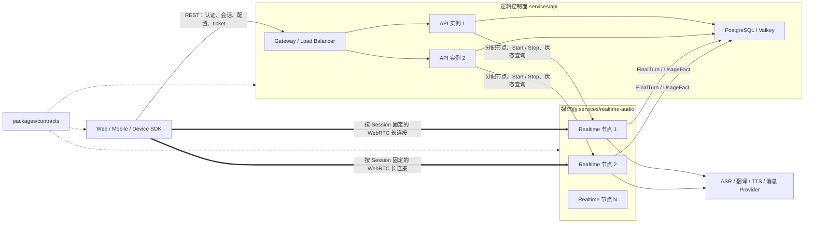
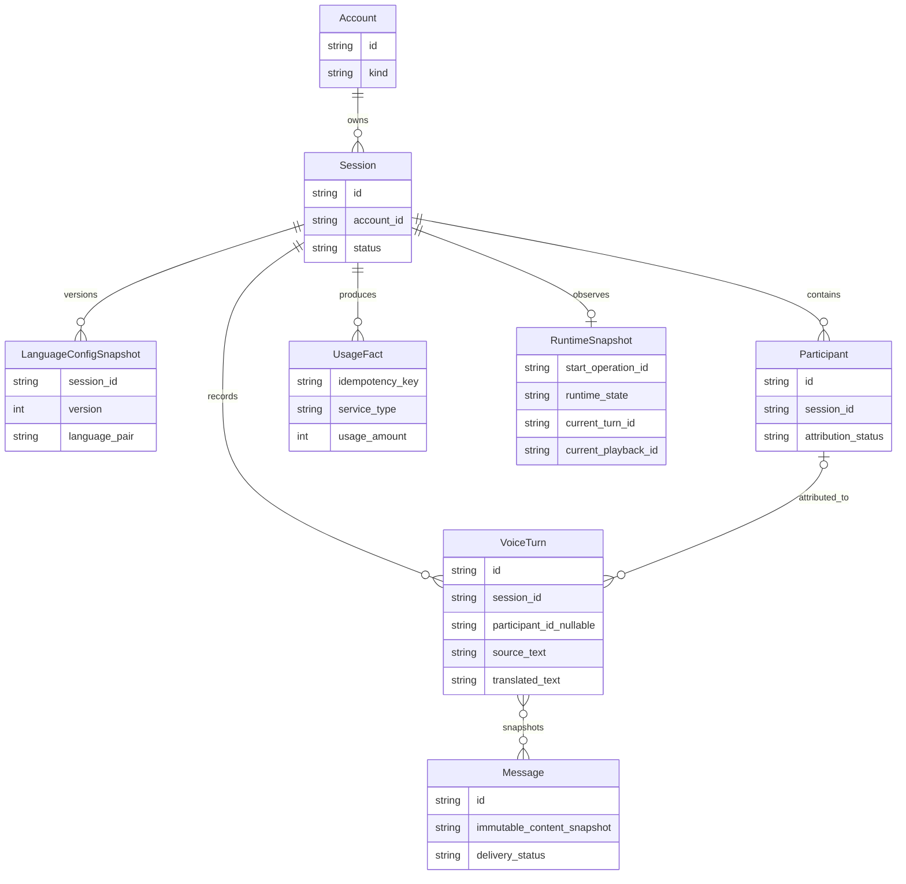
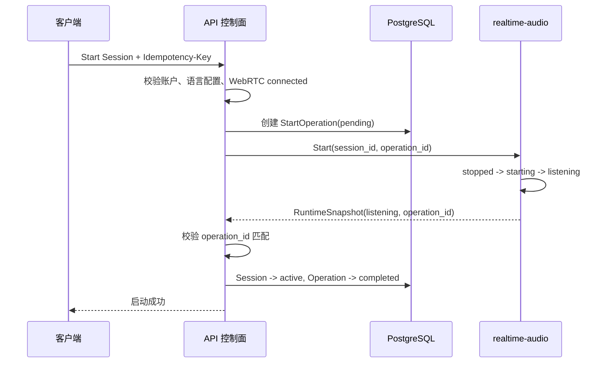

# Lingow 架构总览

## 1. 文档定位

本文用于架构评审和项目汇报，集中回答以下问题：

- 为什么这样设计，系统边界在哪里；
- 系统如何分层，主要模块如何划分；
- 核心对象如何定义，关键链路如何流转；
- 安全性、可靠性和扩展性如何保证；
- 为什么选择当前技术方案；
- 当前还有哪些未决问题和风险。

本文不展开协议字段、完整状态和错误码、数据库字段与 DDL、模块内部接口和全部异常分支。这些内容分别属于协议设计、数据设计和模块详细设计。接口和本地运行方式见
[DEVELOPMENT.md](DEVELOPMENT.md)，目录映射见
[MODULE_DIRECTORIES.md](MODULE_DIRECTORIES.md)，实际数据结构以
`services/api/**/migrations` 为准。

## 2. 架构决策

Lingow 首期解决两方、双语、面对面的句级语音传译：用户轮流说话，系统在一句话结束后播放译文，并支持播放期间的抢话和打断。

一场对话同时包含两类性质不同的状态：

- 账户、会话、语言配置、历史记录和用量是长期业务事实，需要持久化、授权、审计和可靠重试；
- WebRTC 连接、听音、识别、翻译、播放和打断是低延迟运行事实，会在毫秒到秒级持续变化。

如果两类状态由同一个服务或同一套状态机维护，API 会被迫处理音频连接和播放细节，实时服务也会承担账户归属、历史和消息规则，最终形成重复状态和相互阻塞。

因此，Lingow 采用**控制面与媒体面分离的双服务架构**：

- `services/api` 是控制面，拥有需要长期保存的业务事实；
- `services/realtime-audio` 是媒体面，拥有实时音频链路和运行状态；
- `packages/contracts` 是跨服务和跨端契约的唯一来源，不是独立业务服务；
- Web、Mobile 和 Device SDK 是终端接入层，只负责采集、播放、交互和状态展示。

五个业务模块部署在上述两个服务内，不拆成五个微服务。这样既隔离了实时链路，又控制了首期部署和运维复杂度。

## 3. 系统边界

### 3.1 系统内

- 账户认证、会话归属和短期实时接入授权；
- 双语语言配置及 Turn 级配置快照；
- WebRTC 信令、音频接入和连接生命周期；
- VAD、句末检测、ASR、翻译、TTS、播放和打断编排；
- Final Turn、说话人、历史记录和用量持久化；
- 基于已保存 Final Turn 的异步消息投递；
- Web、Mobile 和 Device SDK 的统一接入契约。

### 3.2 系统外

- ASR、翻译、TTS、邮件和企业微信等第三方 Provider；
- 硬件制造、固件和设备底层驱动；
- 多人会议同传、完整离线翻译、管理后台、订单、支付和发票；
- 第三方 Provider 内部的模型训练、容量和可用性管理。

外部 Provider 只能通过适配器进入系统，供应商协议、模型名和凭证不得进入核心业务对象。

## 4. 分层、模块与部署



### 4.1 五个业务模块

五个模块按“谁拥有最终事实”划分：

| 模块 | 所属服务 | 拥有的事实 | 不负责 |
| --- | --- | --- | --- |
| 会话管理 | API | Session 归属、创建、启动、结束及业务状态 | 音频处理和播放状态 |
| 语言配置 | API | 支持语言、双语配置、版本与快照 | 执行 ASR 或翻译 |
| 实时转译 | realtime-audio | WebRTC、Turn 处理、播放、打断和运行状态 | 长期记录与账户规则 |
| 说话人与转译记录 | API | VoiceTurn、Participant、归属修正和历史 | 实时播放决策 |
| 账户、用量与消息 | API | Account、UsageSummary、Message 和投递状态 | 重做翻译或修改 Final Turn 正文 |

模块是业务责任边界，不代表独立部署单元。同步命令用于认证、配置、Start、Stop 和状态查询；`FinalTurn`、`UsageFact` 等已发生事实通过可重试的异步边界交接。

### 4.2 两个服务的扩容方式

控制面是**一个逻辑服务**，不等于只能运行一个进程。它处理低频、短生命周期的认证、会话、配置和查询请求，业务状态外置到 PostgreSQL 和 Valkey，因此单个实例可以管理较多会话，也可以在请求量增长后部署多个 API 副本。

媒体面处理高频、长生命周期的工作。每个活跃 Session 都持续占用 PeerConnection、音频缓冲、Pipeline、Provider 连接、CPU、内存和网络资源，因此主要按**同时在线会话数**水平扩容。

在目标多节点部署中，一个 Session 建立后必须固定到一个 realtime 节点，后续信令、音频、状态查询和 Stop 都路由到该节点，不能按音频帧随机负载均衡：

```text
API 创建 Session
 -> 调度器按健康度、容量和地域选择 realtime 节点
 -> API 签发包含 session 范围和节点路由信息的短期 ticket
 -> 客户端连接指定节点
 -> 节点在会话期间独占 Runtime 和 WebRTC 连接
 -> 会话结束后释放路由和节点资源
```

## 5. 核心对象模型



关键定义如下：

- `Session` 是账户授权、语言配置、实时接入、记录和用量的共同业务边界。
- `LanguageConfigSnapshot` 在每个 Turn 开始时读取一次，本轮内保持不变，避免处理中途改变翻译语义。
- `FinalTurn` 是 realtime-audio 交出的已完成事实；持久化后形成可查询的 `VoiceTurn`。partial ASR 和草稿译文不进入长期历史。
- `Participant` 与正文解耦。说话人暂时不确定时，`participant_id` 可以为空，之后只修正归属，不重写正文。
- `UsageFact` 使用幂等键记录 ASR、翻译、TTS 等用量，重试不能导致重复计量。
- `Message` 只能读取已保存的 Final Turn，并保存不可变内容快照，渠道重试不能改变已发送语义。
- `RuntimeSnapshot` 是媒体面的权威运行状态，API 只查询快照，不复制实时状态机。

系统明确区分三类状态：Session 业务状态、媒体 Pipeline 运行状态和 WebRTC 连接状态。三者可以关联，但不能互相替代。

## 6. 状态流转与一致性

### 6.1 状态所有权

| 状态 | 权威服务 | 示例 |
| --- | --- | --- |
| Session 业务状态 | API | `created / active / ended / failed` |
| Pipeline 运行状态 | realtime-audio | `stopped / starting / listening / translating / playing / stopping / failed` |
| WebRTC 连接状态 | realtime-audio | `new / connecting / connected / disconnected / closed` |
| Start/End 操作记录 | API | 幂等键、operation ID、补偿状态和结束意图 |

两个服务不共同维护同一个状态。API 不修改 Runtime，realtime-audio 也不能直接将 Session 改成 `active` 或 `ended`。跨服务采用“服务内强一致，服务间幂等命令加补偿，事实交接最终一致”，不使用无法覆盖 WebRTC 和 Provider 流的分布式事务。

### 6.2 启动会话



realtime 没有确认启动成功，API 不能把 Session 写成 `active`；返回快照中的 `start_operation_id` 必须与当前操作一致，旧请求不能激活新 Runtime。

如果 realtime 已启动但 API 提交 `active` 失败，API 领取该 StartOperation 的补偿权并幂等调用 Stop。补偿结果持久化为 `compensated` 或 `compensation_failed`，恢复不依赖进程内存或日志。

### 6.3 结束会话

```text
客户端请求 API 结束 Session
 -> API 持久化 EndIntent
 -> API 幂等调用 realtime Stop
 -> realtime 停止 Pipeline、Provider、Track、DataChannel 和 PeerConnection
 -> realtime 返回 stopped 快照
 -> API 将 Session 标记为 ended
```

只有 realtime 明确返回 `stopped`，API 才能将 Session 标记为 `ended`。Stop 超时、失败或结果不确定时，Session 保持未结束，并根据持久化 EndIntent 重试或对账。

### 6.4 一致性手段

- **单一事实来源**：每类状态只有一个所有者，API 通过快照查询实时状态，不复制播放状态机。
- **幂等命令**：Start、Stop 和其他写操作携带稳定幂等键；同 key 不同 payload 必须冲突。
- **操作身份**：`operation_id` 将 Runtime 绑定到发起它的持久化操作，阻止旧请求控制新实例。
- **每 Session 串行化**：数据库锁和唯一约束避免多个 API 实例同时启动、结束或补偿同一 Session。
- **对账恢复**：恢复流程根据 Session、StartOperation、EndIntent 和 RuntimeSnapshot 联合判断继续、补偿或等待。
- **可靠事实交接**：FinalTurn 和 UsageFact 通过 durable outbox 至少一次投递，再以 event ID 或幂等键去重。

系统允许跨服务存在短暂差异，但始终保护三个不变量：未确认启动不能 `active`，未确认停止不能 `ended`，旧操作不能控制新的 Runtime。

## 7. 从用户故事看核心链路

假设一位中文用户和一位外语用户准备面对面交流，整个过程可以用五个用户故事说明。

### 7.1 开始一场对话

用户打开 Lingow，选择双方使用的语言，然后点击“开始”。系统先确认用户有权使用这场对话，再找一台空闲的实时语音服务器建立语音通道。页面显示“可以开始说话”后，双方就可以直接交流。

对用户来说这是一次点击；系统内部则先确定“这是谁的对话、使用哪两种语言”，再开放麦克风和实时处理能力。这样即使后面增加更多实时语音服务器，用户的操作也不会改变。

### 7.2 说完一句，听到一句译文

一方开始说话后，系统一边听、一边在后台识别内容，但不会把尚未说完的半句话直接播放出来。检测到用户停顿并确认一句话结束后，系统才整理完整意思、翻译成另一种语言并播放给对方。

这句已经确认的原文和译文会保存到历史记录，用量也只记一次。保存记录或统计用量即使暂时变慢，也不会要求用户停下来等待，下一轮对话仍然可以继续。

### 7.3 对方插话，系统立即让出声音

如果译文还在播放，对方已经开始说话，系统会立即停止当前播放，转而听取新的发言。这样系统不会继续和用户抢声音，也不需要用户先寻找停止按钮。

已经确认并保存的上一句话不会因为这次打断而丢失；被打断的只是当前播放动作，不会反过来修改整场对话是否有效。

### 7.4 用户结束对话

用户点击“结束”后，终端先停止继续采集声音，系统再关闭这场对话占用的实时处理和语音连接。只有确认这些资源都已经关闭，系统才把这场对话标记为结束。

如果关闭请求超时或结果暂时不确定，系统会保留这次结束请求并继续处理，而不是提前告诉用户“已经结束”却仍在后台收音。

### 7.5 会后查看和发送结果

用户之后可以查看已经确认的对话记录。某句话暂时无法判断是谁说的，可以先保留内容，之后再补充或修正说话人，不会因为识别不确定而丢掉整句话。

需要通过邮件或企业微信发送时，系统只使用已经保存的内容生成固定快照。即使网络重试，也不会重复保存同一句话、重复统计用量或在重试过程中改变消息内容。

从用户视角看，主流程只有“开始、说话、听译文、可以插话、结束和查看记录”；控制面和媒体面的拆分，是为了让这些简单操作在失败、重试和扩容时仍然保持一致。

## 8. 技术取舍

| 选择 | 原因 | 未选择方案及原因 |
| --- | --- | --- |
| 控制面与媒体面双服务 | 隔离长期事务和低延迟音频状态，同时保持部署数量可控 | 单体会混合两类状态；五个微服务会增加分布式事务和运维成本 |
| WebRTC 传输音频 | 原生支持双向实时媒体、Opus、抖动处理、ICE 和 DataChannel | WebSocket 适合控制事件，但自行承载音频需要额外处理时序、抖动、编解码和弱网 |
| REST/OpenAPI 处理业务控制 | 适合资源型会话、配置、历史查询和标准 HTTP 鉴权 | 当前没有采用 JSON-RPC；若未来出现大量双向命令，再评估其必要性 |
| AsyncAPI/版本化事件交接事实 | 解耦实时链路和持久化、用量、消息处理，允许可靠重试 | 同步串行调用会把数据库或消息渠道故障带入实时主链路 |
| Go + Pion | 适合并发连接、显式 Context 取消、静态类型和 WebRTC 服务端实现 | 在现有团队和代码基础上改用其他运行时收益不足以抵消迁移成本 |
| PostgreSQL 作为业务真源 | 事务、外键、唯一约束和索引适合账户归属、幂等与审计 | NoSQL 对当前强关系和一致性模型没有明显优势 |
| Valkey 用于异步队列和延迟重试 | 适合短生命周期任务、消费组和重试调度 | 不作为最终业务真源，避免队列状态替代数据库事实 |
| Provider Adapter | 隔离模型和渠道供应商协议，支持 mock、替换和离线测试 | 核心 Pipeline 直接调用供应商会造成协议泄漏和供应商锁定 |
| 句级 Turn、句末播音 | 首期语义稳定、回声与打断边界清晰，符合面对面轮流说话 | 边听边播和多人会议同传需要更复杂的增量语义修正与音频混流 |

## 9. 非功能需求（NFR）

| 维度 | 当前架构保证 | 尚需量化或验证 |
| --- | --- | --- |
| 性能 | 音频绕过 API；媒体 Pipeline 可流式处理；长期后处理不阻塞实时链路 | 句末到首包 TTS、打断生效、并发会话数和资源上限尚无正式 SLO |
| 可靠性 | Start/Stop、语言配置、FinalTurn、UsageFact 和消息投递均按幂等设计；使用 outbox、重试和租约 | 需要故障注入、进程崩溃恢复和长时间稳定性测试 |
| 一致性 | PostgreSQL 保存权威业务事实；同一幂等键不同 payload 必须冲突；结束前先确认 realtime stopped | 跨服务事实的最终一致窗口和人工恢复流程尚未正式定义 |
| 安全性 | Bearer Access Token、Session 归属校验、短期 realtime ticket、凭证环境注入、消息目标验证 | ticket 撤销、密钥轮换、限流策略和生产安全基线仍需闭环 |
| 扩展性 | 控制面与媒体面可独立扩容；终端通过 contracts 接入；Provider 可替换 | 多 realtime 节点仍需会话路由、租约和分布式协调 |
| 可观测性 | 请求和事件包含 request ID、trace ID、稳定错误码和运行状态快照 | 指标、日志、追踪、告警阈值和端到端延迟看板尚未统一 |
| 可维护性 | 统一 contracts、模块端口、离线单测、契约测试和隔离的集成测试 | 语言配置和部分实时事件仍未完全迁入 contracts |

未正式冻结的数值不得作为已达成指标对外承诺。性能、容量、恢复时间和可用性目标应在真实链路完成后通过压测和故障演练确定。

## 10. 当前实现状态、未决问题与风险

### 10.1 当前实现状态

- API 已装配账户、会话、语言配置、记录、用量和消息模块，并已有会话主流程集成测试。
- realtime-audio 已有生命周期、控制面 Handler、WebRTC、Pipeline 和 Provider Adapter，但当前缺少可独立运行的进程入口与完整生产装配。
- records、会话和部分 realtime 契约已进入 `packages/contracts`；语言配置及部分 DataChannel 事件仍有契约缺口。
- Web、Mobile 和 Device SDK 尚未形成上述双服务架构的完整端到端消费者链路。

因此，对外应表述为：**核心控制面及媒体面组件已有实质实现，但 realtime 生产装配、多节点调度与端到端接入尚未完全闭环。**

### 10.2 未决问题与风险

1. **端到端装配**：需要补齐 realtime 进程入口、ticket 公开申请和 Web/Device 的真实消费者链路。
2. **多节点调度**：需要节点注册、健康与容量上报、`session_id -> node` 路由目录、会话亲和和跨节点状态查询。
3. **节点故障恢复**：WebRTC 和 Runtime 具有节点内所有权，需要明确租约、孤立连接回收和故障后的会话恢复策略。
4. **契约完整性**：语言配置、UsageFact 和 DataChannel 实时事件需要完全收敛到 contracts，避免跨服务重复定义。
5. **事件基础设施**：当前 FinalTurn 可写入共享 PostgreSQL outbox；长期需要明确共享数据库与独立消息代理之间的服务所有权取舍。
6. **NFR 数值**：尚未冻结端到端延迟、打断时延、并发容量、可用性、RTO 和 RPO，不能只凭单元测试宣称达标。
7. **第三方依赖**：ASR、翻译和 TTS 的延迟、限流、成本、内容安全和区域可用性需要真实环境验证，并制定降级策略。
8. **实时授权**：需要闭环 ticket 撤销、Session 结束后的旧票据拒绝、密钥轮换和重放防护。
9. **产品与硬件假设**：最终语言范围、硬件音频格式、弱网标准、说话人绑定方式和是否支持蓝牙配网仍待确认。

这些问题不改变控制面/媒体面分离的总体方向，但会影响部署拓扑、容量规划和生产验收标准。
