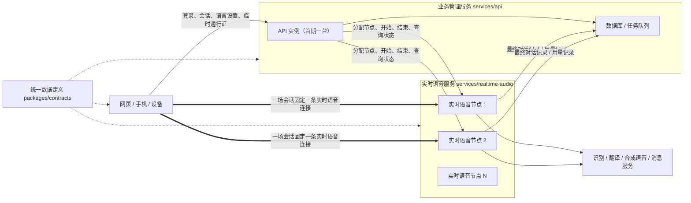
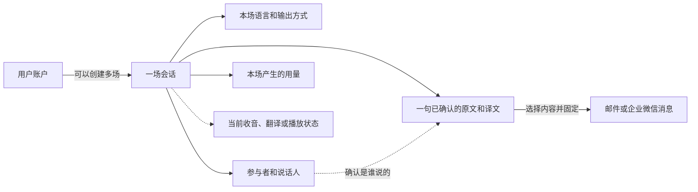
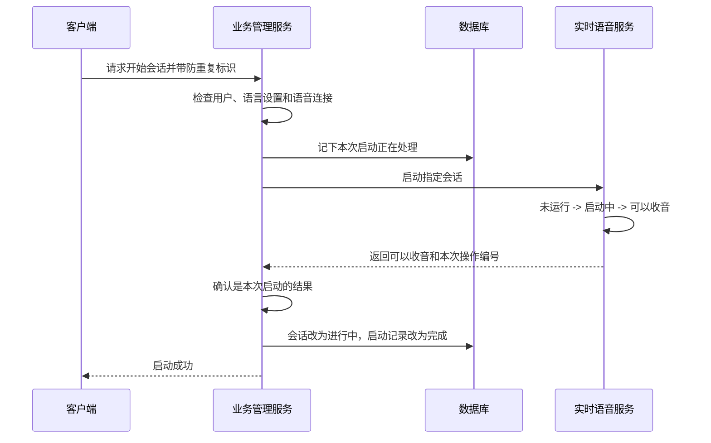
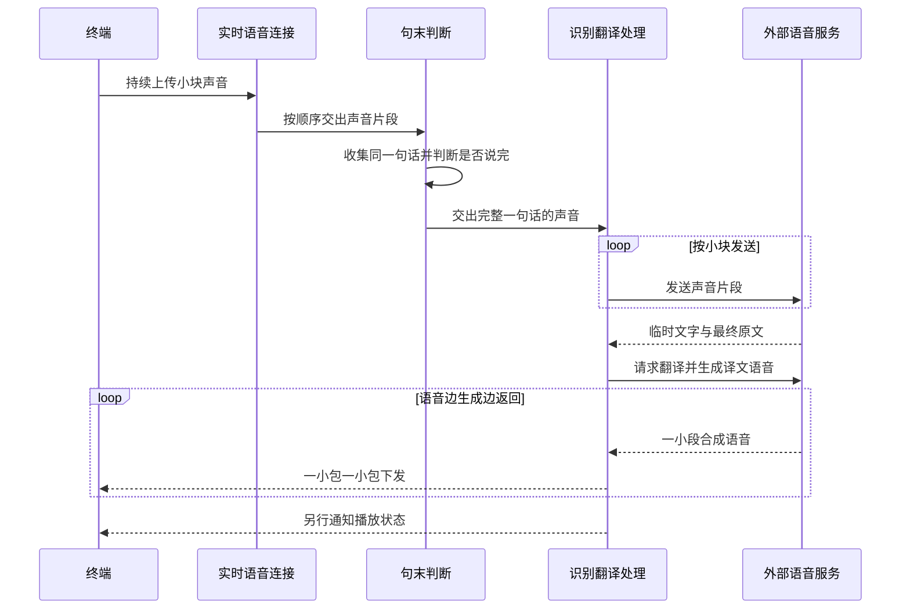

# Lingow 架构总览

## 1. 文档定位

本文用于架构评审和项目汇报，集中回答以下问题：

- 为什么要拆成两个后端服务；
- 每个服务负责什么、不负责什么；
- 主要模块和核心数据如何划分；
- 用户从开始说话到听见译文，中间发生了什么；
- 系统如何避免数据重复、状态打架和故障后无法恢复；
- 为什么选择当前技术，以及还有哪些问题没有解决。

为了便于汇报，正文优先使用中文白话；反引号中的代码对象名和“研发代码对照表”只供技术人员核对，不需要在汇报时逐项念出。

本文不展开每个接口的请求字段、完整状态和错误码、数据库表字段、模块内部接口和全部异常分支。这些内容分别属于协议设计、数据设计和模块详细设计。接口和本地运行方式见
[DEVELOPMENT.md](DEVELOPMENT.md)，目录映射见
[MODULE_DIRECTORIES.md](MODULE_DIRECTORIES.md)，实际数据结构以
`services/api/**/migrations` 为准。

## 2. 为什么要这样设计

Lingow 首期解决两个人、两种语言、面对面交流时的语音翻译：用户轮流说话，每个方向都可以选择把译文显示在手机上，或在一句话结束后播放给对方；播放期间有人重新说话时，系统会停止旧声音并开始收音。

一场对话里有两类完全不同的事情：

- 第一类是“以后还要查”的内容，例如用户是谁、会话是否结束、使用哪两种语言、说过什么以及用了多少服务。这些内容必须长期保存；
- 第二类是“通话当下正在发生”的动作，例如是否还在收音、是否已经听完一句话、是否正在翻译、播放或被打断。这些动作变化很快，通常只在本次通话中有意义。

如果把两类事情都交给一个服务，普通的账户查询可能影响实时收音，语音服务也会被迫处理历史记录和账户规则，两个方向会互相拖累。

因此，Lingow 拆成两个后端服务。汇报时可以直接称为**业务管理服务**和**实时语音服务**：

- 业务管理服务（`services/api`，技术上称控制面）负责用户、会话、语言设置、历史记录和用量；
- 实时语音服务（`services/realtime-audio`，技术上称媒体面）负责接收声音、识别、翻译、合成语音、播放和打断；
- 统一数据定义（`packages/contracts`）规定各端交换的数据长什么样，避免不同模块各说各话；
- 网页、手机和设备只负责采集声音、播放声音、接受操作和展示结果，不替后端做业务判断。

五个业务模块放在上述两个服务中，不拆成五套独立程序。这样既能让实时语音不受普通业务拖累，也不会在首期引入过多部署和维护工作。

## 3. 系统管什么、不管什么

### 3.1 我们负责

- 账户认证、会话归属和短期实时接入授权；
- 双语设置、每个说话方向的输出方式，以及每句话开始时固定下来的设置；
- 建立和关闭实时语音连接；
- 判断用户何时开始和停止说话、把语音变成文字、翻译、把译文变成语音，以及播放和打断；
- 保存已经确认的原文、译文、说话人、历史记录和用量；
- 把已经保存的翻译结果发送到邮箱或企业微信；
- 网页、手机和设备使用同一套接入数据格式。

### 3.2 我们不负责

- 语音识别、翻译、语音合成、邮件和企业微信等外部服务；
- 硬件制造、固件和设备底层驱动；
- 多人会议同传、完整离线翻译、管理后台、订单、支付和发票；
- 外部服务内部的模型训练、容量和可用性管理。

外部服务必须通过单独的“供应商连接器”接入。以后更换供应商时，只替换连接器，不改会话、记录和计费规则。

## 4. 两个服务和五个模块



### 4.1 五个业务模块

五个模块按“遇到分歧时谁做最终决定”划分：

| 模块 | 所属服务 | 最终负责 | 不负责 |
| --- | --- | --- | --- |
| 会话管理 | 业务管理服务 | 会话属于谁、何时开始、何时结束 | 收音和播放细节 |
| 语言配置 | 业务管理服务 | 支持哪些语言、双方使用哪两种语言、译文显示还是播放 | 实际执行识别和翻译 |
| 实时转译 | 实时语音服务 | 收音、判断句末、识别、翻译、播放、打断 | 长期保存记录和账户规则 |
| 说话人与转译记录 | 业务管理服务 | 保存每句话、判断谁说的、查询和修正历史 | 决定当前是否播放 |
| 账户、用量与消息 | 业务管理服务 | 用户身份、用量汇总、邮件和企业微信发送状态 | 重新翻译或修改已经确认的正文 |

这五个模块只是责任划分，不是五个独立服务。需要马上得到结果的操作直接调用；已经发生的最终记录和用量记录先可靠记下，再交给另一边处理，短暂失败可以重试。

### 4.2 为什么 API 首期部署一台就够

API 处理登录、创建会话、语言设置、历史查询和签发临时通行证。这些请求通常很短，声音也不会经过 API；重要数据保存在 PostgreSQL，待发送任务保存在数据库和 Valkey，而不是只放在 API 进程内存中。因此，一台 API 实例就可以支撑比单台实时语音节点更多的会话。

这里的“单 API”是**首期部署方式**，不是把系统永远限制为一台机器。API 重启后可以从数据库恢复业务状态；请求量继续增加时，可以在统一入口后复制多个 API 实例，而不需要改变业务模块边界。

单实例仍然存在可用性风险：机器重启期间新请求会暂时失败。正式环境至少需要进程自动拉起、健康检查、数据库高可用和明确的恢复时间；对 API 入口有更高可用性要求时，再部署第二个实例。

当前代码通过一个固定的 `REALTIME_BASE_URL` 连接实时语音服务。这适合单个实时语音地址，但还不能完成多节点选择和按会话路由。

### 4.3 为什么实时语音服务需要部署多台

实时语音服务处理的是长时间工作。每场进行中的对话都会持续占用一条实时连接、收发声音的缓冲、识别和语音合成连接、处理器、内存和网络带宽。因此它不是主要按“每秒多少个接口请求”扩容，而是按**同时在线会话数**扩容。

当前每场会话的实时连接和语音处理任务都保存在所在节点的内存中。一场会话开始后，必须固定在同一台实时语音节点上；后续的声音、播放状态、查询和结束请求都要回到这台节点，不能把同一场对话的小声音块随机分给多台机器。

这也意味着，节点突然退出时，正在进行的实时连接无法原样搬到另一台机器。已经保存的文字和用量不会丢，但客户端需要重新连接，再由业务管理服务分配新的节点。

### 4.4 一场会话怎样找到同一台语音节点

目标多节点部署需要增加一份“会话路由目录”，记录每场会话当前属于哪台实时语音节点。完整流程是：

```text
业务管理服务创建会话
 -> 从健康且有空位的节点中选择一台
 -> 在共享存储中记录“会话 -> 节点”和本次分配编号
 -> 返回该节点的连接地址和短时间有效的通行证
 -> 客户端连接指定节点
 -> 后续开始、查询和结束操作先查路由目录，再访问同一节点
 -> 会话确认结束后，释放路由和节点容量
```

临时通行证应限制用户、会话、目标节点和有效时间。也可以在统一实时入口根据路由目录转发，但不能使用普通的随机负载均衡，否则同一会话的连接和结束请求可能落到不同节点。

### 4.5 多实例调度需要考虑哪些信息

| 信息 | 用途 |
| --- | --- |
| 节点编号和访问地址 | 唯一找到一台实时语音节点，并把客户端和后续控制请求送到同一处 |
| 最近一次心跳和健康状态 | 排除已经失联、正在启动或检查失败的节点 |
| 当前会话数和最大会话数 | 避免把新会话继续分给已经满载的节点 |
| 处理器、内存、网络和音频缓冲压力 | 会话数量相同也可能负载不同，需要避免单项资源先耗尽 |
| 所在地区和网络延迟 | 尽量选择离用户更近的节点，减少声音往返时间 |
| 外部识别和语音合成额度 | 防止节点仍有机器资源，但供应商连接数或调用额度已经用完 |
| 支持的语言、音频格式和程序版本 | 只把会话分给真正支持本次能力的节点，并保证升级期间兼容 |
| 是否接收新会话 | 节点升级或下线前先进入“只服务旧会话”状态，等旧会话结束后再关闭 |
| 会话归属编号和有效期 | 阻止旧节点或过期分配继续修改已经转移的会话 |

调度时不需要追求一次选出“永远最优”的节点，只需要排除不健康和不兼容节点，再在有足够余量的节点中选择。选择结果一旦确定，本场会话期间就保持不变。

## 5. 核心业务对象及关系



上图只表达业务关系；对应的代码对象名如下：

- **会话（`Session`）**：把用户、语言设置、实时连接、对话记录和用量归到同一场对话下面。
- **本句话使用的设置（`LanguageConfigSnapshot`）**：每句话开始时把语言方向和输出方式固定下来。即使用户中途改设置，也从下一句话生效，不改变正在处理的这句话。
- **最终对话结果（`FinalTurn`，保存后称 `VoiceTurn`）**：只保存已经确认的完整原文和译文；识别过程中的临时文字不进入历史记录。
- **说话人（`Participant`）**：暂时不知道是谁说的，也可以先保存正文，之后只补充说话人，不重写已经确认的内容。
- **用量记录（`UsageFact`）**：分别记录语音识别、翻译和语音合成用了多少。同一条记录即使重试，也只能统计一次。
- **外发消息（`Message`）**：邮件或企业微信发送前先固定内容，之后无论重试多少次都不能悄悄改变正文。
- **实时状态快照（`RuntimeSnapshot`）**：由实时语音服务给出“正在听、正在翻译还是正在播放”，业务管理服务只查询，不再自己维护一份。

系统把三件事分开管理：整场会话是否开始或结束、当前声音处理到哪一步、实时语音连接是否正常。三者有关联，但不是同一件事。

## 6. 两个服务如何保持状态一致

### 6.1 每种状态由谁做主

| 状态 | 由谁负责 | 示例 |
| --- | --- | --- |
| 整场会话的状态 | 业务管理服务 | 已创建、进行中、已结束、失败 |
| 当前语音处理状态 | 实时语音服务 | 未运行、启动中、正在听、正在翻译、正在播放、停止中、失败 |
| 实时语音连接状态 | 实时语音服务 | 新建、连接中、已连接、已断开、已关闭 |
| 开始和结束请求的处理记录 | 业务管理服务 | 防重复标识、本次操作编号、失败后的收尾进度 |

同一种状态只能由一个服务做主，不能两边各记一本账。业务管理服务不能擅自说“正在播放”，实时语音服务也不能擅自把整场会话改成“已结束”。两个服务之间允许短时间不同步，但所有请求都能防重复、失败后能继续收尾，最终会回到一致结果。

### 6.2 启动会话



只有实时语音服务明确回答“已经可以收音”，业务管理服务才能把会话标为“进行中”。每次启动都有唯一编号，过期请求返回得再晚，也不能启动一场新的会话。

如果实时语音已经启动，但业务管理服务没能保存“进行中”，后台会根据已经保存的启动记录自动关闭这条语音连接。机器即使中途重启，也能继续完成这次收尾，而不是留下一个无人管理、仍在收音的连接。

### 6.3 结束会话

```text
客户端请求结束会话
 -> 业务管理服务先记下“用户要结束”
 -> 通知实时语音服务停止，重复通知也只执行一次
 -> 实时语音服务停止识别、翻译、播放并关闭语音连接
 -> 实时语音服务确认已经停止
 -> 业务管理服务将会话标记为已结束
```

只有实时语音服务明确确认“已经停止”，业务管理服务才能把会话标为“已结束”。如果关闭请求超时或结果不确定，系统会保留用户的结束要求并继续重试，不会一边显示已结束、一边还在后台收音。

### 6.4 具体怎么保证不重复、不打架

- **一件事只有一本账**：整场会话由业务管理服务做主，当前收音和播放由实时语音服务做主。
- **重复请求不会重复执行**：开始、结束、保存记录和统计用量都带防重复标识；用户连点或网络重发不会创建两份结果。
- **每次操作有自己的编号**：旧请求即使晚到，也不能控制后来新建的实时连接。
- **同一场会话排队处理**：同一时刻只处理一个开始、结束或失败收尾动作，避免两台业务服务器互相覆盖。
- **失败后能继续收尾**：后台根据已经保存的操作记录和实时状态，判断应该继续、关闭还是等待。
- **重要结果先记下再转交**：最终对话记录和用量先写入可靠待办，再反复投递；接收方按唯一编号去重。

系统允许两个服务短时间不同步，但始终守住三条底线：没有确认开始就不能显示“进行中”，没有确认停止就不能显示“已结束”，旧请求不能控制新的语音连接。

### 6.5 多台语音节点时怎么保持一致

多台实时语音节点共同工作时，最重要的不是让每台机器都保存一份相同状态，而是明确：**这场会话现在归哪台节点处理，以及谁有权写回结果。** 业务数据库保存会话和节点归属的最终记录，实时语音节点只保存自己正在处理的连接和声音状态。

| 要保持一致的内容 | 谁做最终决定 | 怎么保证 |
| --- | --- | --- |
| 会话是否已经开始或结束 | 业务数据库 | 一个数据库操作内检查旧状态并写入新状态；同一场会话的操作排队处理 |
| 会话现在属于哪台语音节点 | 共享的会话路由目录 | 同一时间只允许一条有效归属；每次重新分配都产生新的分配编号和有效期 |
| 当前正在收音、翻译还是播放 | 当前归属的语音节点 | 只查询这台节点，不在 API 中复制一套实时状态 |
| 最终原文和译文 | 业务数据库 | 每句话有唯一编号，同一结果重复送达也只保存一次 |
| 识别、翻译和合成语音用量 | 业务数据库 | 每条用量有防重复编号，重试不会重复计费 |
| 哪些节点健康、是否还有空位 | 节点目录 | 节点定期报平安并上报容量；超时未上报的节点不再接收新会话 |

一场会话至少要带上四个编号，才能判断请求是不是发给了正确的机器：

- **会话编号（`session_id`）**：说明是哪场对话。
- **节点编号（`node_id`）**：说明当前由哪台实时语音节点处理。
- **启动操作编号（`start_operation_id`）**：说明这是用户的哪一次启动请求，防止上一次请求迟到后误启动。
- **节点分配编号（`route_version`）**：说明这是第几次分配。会话重新分配后，旧编号立即失效，旧节点即使恢复也不能继续写入。

开始一场会话时，业务管理服务先锁定这场会话，在数据库中记下“准备启动”、目标节点和本次分配编号，再调用指定节点。节点检查会话编号、启动编号和分配编号都正确后才开始收音；节点明确确认后，业务管理服务才把会话改成“进行中”。结束、状态查询和后续控制也先查路由目录，再访问同一台节点。

节点突然失联时，系统不能把正在进行的实时连接悄悄搬到另一台机器，因为客户端和旧节点之间的声音通道已经断开。正确做法是停止给故障节点分配新会话，将旧归属作废，给需要继续的会话生成新的分配编号，并让客户端连接新节点。已经保存的最终文字和用量仍然保留；尚未确认的一小段声音可能需要用户重说，不能承诺无感恢复。

后台还需要定期核对三份信息：数据库里的开始和结束记录、会话路由目录、节点实际报告的状态。发现“数据库还在等待，但节点已经启动”或“节点失联，但数据库仍显示处理中”时，后台根据操作编号继续确认、关闭或提示重连，而不是直接猜测结果。

当前代码已经有数据库锁、开始和结束操作记录、启动操作编号，以及最终对话记录和用量的防重复处理。**节点注册、心跳和容量上报、共享路由目录、通行证绑定节点、节点分配编号及旧节点写入拦截仍是目标设计，尚未落地。**

## 7. 从用户故事看核心链路

假设一位中文用户和一位外语用户准备面对面交流，整个过程可以用六个用户故事说明。

### 7.1 开始一场对话

用户打开 Lingow，选择双方使用的语言，然后点击“开始”。系统先确认用户有权使用这场对话，再找一台空闲的实时语音服务器建立语音通道。页面显示“可以开始说话”后，双方就可以直接交流。

对用户来说这是一次点击；系统内部则先确定“这是谁的对话、使用哪两种语言”，再开放麦克风和实时处理能力。这样即使后面增加更多实时语音服务器，用户的操作也不会改变。

### 7.2 需要播放时，说完一句听到一句译文

一方开始说话后，系统一边接收声音、一边判断这句话是否说完，但不会把尚未说完的半句话直接播放出来。检测到用户停顿并确认一句话结束后，系统才识别并整理完整意思、翻译成另一种语言；如果这个说话方向选择了语音输出，再把译文播放给对方。

这句已经确认的原文和译文会保存到历史记录，用量也只记一次。保存记录或统计用量即使暂时变慢，也不会要求用户停下来等待，下一轮对话仍然可以继续。

#### 7.2.1 用户说的话怎么传上来

实时语音连接建立后，终端不需要先录成一个完整文件，也不需要反复调用接口。可以把整个过程理解成“把声音切成连续的小包裹，按顺序寄给服务器”：

1. 手机或设备一边收音，一边把声音压缩成很小的数据块，沿同一条实时连接连续上传。
2. 实时语音服务按顺序接收这些小块，还原成统一格式的声音片段，并暂存在一个很小的内存队列中。
3. 系统一边接收，一边判断“用户开始说话了吗”和“这句话说完了吗”，同时把属于同一句话的片段收集在一起。
4. 确认一句话结束后，系统才为这句话建立一条处理记录，并把刚才收集的声音片段按顺序送去语音识别。
5. 识别服务可能多次返回尚未确认的临时文字，但系统只使用最后确认的完整原文继续翻译、保存和播放。

这里的“流式”不是把每个小声音块单独翻译，而是声音一直在上传；系统先把它们凑成一句完整的话，再把这一句话分块送去识别。这样既不用等待上传完整录音文件，也不会把半句话误当成最终结果。

#### 7.2.2 译文语音怎么发回去

得到完整译文后，系统先把已经确认的文字结果可靠记下，再开始生成语音。这样即使后面的合成或播放失败，文字结果也不会丢失，更不会重新翻译和重复计费。下发过程可以理解成“声音还在生成，前面已经生成的部分就先发出去播放”：

1. 系统把完整译文交给语音合成服务。对方不用等整段声音全部做好，而是做好一小段就返回一小段。
2. 收到第一段真实声音后，系统才把状态改为“正在播放”；只有创建了任务、还没有声音时，不会提前显示播放中。
3. 实时语音服务把每一小段声音继续切成大约 20 毫秒的小包，编号后按顺序发回终端。
4. 终端边接收边播放，不需要等待或反复下载完整音频文件。开始、结束、被打断和被取消等播放状态通过旁边的一条文字消息通道通知终端。
5. 如果播放期间有人重新说话，系统只停止当前这段译文，保留整条实时连接，马上继续收下一句话。



声音和状态通知使用不同通道，避免大段声音数据挡住“已经开始播放”或“已经停止”等小消息：

| 数据 | 传输通道 | 当前内容与作用 |
| --- | --- | --- |
| 用户说话的声音 | 实时连接的上行声音通道 | 连续上传压缩后的小块声音，服务端还原后判断句末 |
| 播放给用户的声音 | 实时连接的下行声音通道 | 语音边生成边下发，终端边接收边播放 |
| 播放状态 | 实时连接的文字消息通道 | 通知终端开始、完成、打断和取消 |
| 最终文字和用量 | 可重试的后台消息 | 交给业务管理服务保存和汇总，重复收到也只处理一次 |

下面的技术名词只用于研发人员核对代码，汇报时不需要逐项讲解：

| 处理位置 | 内部接口 | 代码入口 |
| --- | --- | --- |
| 接收并还原上行声音 | `OnTrack`、`PionAudioSource.readLoop` | `services/realtime-audio/webrtc/pion_factory.go:179`、`services/realtime-audio/webrtc/media.go:404` |
| 把声音片段凑成完整一句话 | `segment.Service.Run` | `services/realtime-audio/segment/service.go:62` |
| 分块发送到语音识别服务 | `ASR.StartStream`、`PushAudio` | `services/realtime-audio/pipeline/flow.go:75`、`:91` |
| 翻译并开始生成译文语音 | `HandleASRFinal`、`TTS.StartStream` | `services/realtime-audio/pipeline/service.go:104`、`:176` |
| 分块下发译文语音 | `publishTTSChunks`、`PionAudioTrack.Write` | `services/realtime-audio/pipeline/service.go:202`、`services/realtime-audio/webrtc/media.go:126` |
| 回传播放状态 | `playback.EventSink`、`PionEventSink.Publish` | `services/realtime-audio/playback/service.go:55`、`services/realtime-audio/webrtc/media.go:286` |

临时识别文字不会触发翻译、计费、语音合成或长期保存；只有句末确认后的完整结果才能进入这些环节。最终对话记录和用量记录可以安全重试，声音本身不经过数据库。当前服务端已经能发送播放开始和结束等通知，但终端还没有完整接通“实时显示最终字幕”的统一消息。

### 7.3 对方的话发到手机，我的话播放给对方

有些场景下，用户不希望对方的话翻译后再被手机念一遍。系统确认对方的一句话后，把译文立即发送并显示在用户手机上，不再生成和播放声音。用户看一眼手机就能理解，双方也不必等待这段译文播完。

轮到用户回答时，系统把用户的话翻译成对方的语言，并照常播放给对方。这样，对方不需要看用户的手机，用户也不会反复听到原本就是给自己看的译文。

这不是一场对话的新状态，而是两个说话方向各自的输出选择。系统根据当前是谁在说话，决定译文是发到手机还是播放给对方；切换选择从下一句话开始，不改变正在处理的内容，也不影响对话记录。

这是目标输出策略。当前代码在得到完整译文后默认生成并播放语音；“某个方向只把译文发到手机、不再生成声音”的设置、方向判断和手机通知还没有完整实现。

### 7.4 对方插话，系统立即让出声音

如果译文还在播放，对方已经开始说话，系统会立即停止当前播放，转而听取新的发言。这样系统不会继续和用户抢声音，也不需要用户先寻找停止按钮。

已经确认并保存的上一句话不会因为这次打断而丢失；被打断的只是当前播放动作，不会反过来修改整场对话是否有效。

### 7.5 用户结束对话

用户点击“结束”后，终端先停止继续采集声音，系统再关闭这场对话占用的实时处理和语音连接。只有确认这些资源都已经关闭，系统才把这场对话标记为结束。

如果关闭请求超时或结果暂时不确定，系统会保留这次结束请求并继续处理，而不是提前告诉用户“已经结束”却仍在后台收音。

### 7.6 会后查看和发送结果

用户之后可以查看已经确认的对话记录。某句话暂时无法判断是谁说的，可以先保留内容，之后再补充或修正说话人，不会因为识别不确定而丢掉整句话。

需要通过邮件或企业微信发送时，系统只使用已经保存的内容，并在创建发送任务时把正文固定下来。即使网络重试，也不会重复保存同一句话、重复统计用量或在重试过程中改变消息内容。

从用户视角看，主流程只有“开始、说话、选择译文发到哪里、可以插话、结束和查看记录”；拆成业务管理服务和实时语音服务，是为了让这些简单操作在失败、重试和增加机器时仍然保持一致。

## 8. 为什么选择这些技术

| 选择 | 原因 | 未选择方案及原因 |
| --- | --- | --- |
| 两个后端服务 | 把需要长期保存的业务数据和必须快速响应的实时语音分开，互不拖累 | 全放在一个服务里会混在一起；现在就拆成很多小服务又会让部署和排查过于复杂 |
| 实时语音连接（WebRTC） | 一条连接就能同时上传和下发声音，并自带弱网下的顺序和抖动处理 | 普通消息连接更适合传文字；用它传声音，需要自己补齐编解码、顺序和弱网处理 |
| 普通 HTTP 接口（REST/OpenAPI） | 登录、会话、语言设置和历史查询都是清晰的请求和响应，便于确认调用者身份和排查问题 | 当前没有必要引入另一套 JSON-RPC 调用方式，避免同时维护两套相似协议 |
| 可重试的后台消息 | 保存记录、统计用量或发送消息暂时失败时可以稍后重试，不堵住实时对话 | 如果所有步骤都排队同步完成，数据库或消息渠道变慢会直接卡住用户说话 |
| Go 和 Pion | 现有代码和团队已经使用这套方案，适合同时维护大量长连接，停止和超时边界也比较清楚 | 更换编程语言或实时连接库的收益不足以抵消重写和迁移成本 |
| PostgreSQL 数据库 | 用户、会话、记录和用量关系明确，需要事务、唯一约束和审计能力 | 文档型数据库对当前强关联数据没有明显优势 |
| Valkey 任务队列 | 适合暂存待发送任务、失败重试和延迟处理 | 它只负责排队，不作为最终账本，避免队列丢失时业务记录也跟着丢失 |
| 供应商连接器 | 识别、翻译、合成语音和消息渠道都可以替换，也便于测试失败场景 | 如果业务流程直接调用某一家供应商，以后换模型或渠道会牵动整条主流程 |
| 按一句话处理、按方向选择显示或播放 | 完整一句话的意思更稳定；只需要看文字的方向可以省掉生成和播放时间 | 边说边播和多人同时说话需要处理半句话被推翻、回声和多路声音混合，首期复杂度过高 |

## 9. 系统质量要求（NFR，也就是速度、稳定性和安全性等）

| 维度 | 当前架构保证 | 尚需量化或验证 |
| --- | --- | --- |
| 响应速度 | 声音直接进入实时语音服务；音频边接收边处理、合成语音边生成边播放；保存历史不挡住收音 | 从一句话结束到听见第一段译文、打断多久生效、单台机器支持多少会话，还没有正式目标数值 |
| 可靠性 | 重复的开始、结束、保存和发送请求只执行一次；重要待办先保存，失败可以重试；失联连接会被回收 | 还需要模拟数据库断开、外部服务超时和进程突然退出，并进行长时间运行测试 |
| 数据一致 | 数据库保存最终业务记录；同一防重复标识不能对应两份不同内容；语音服务确认停止后才能结束会话 | 两个服务最多允许不同步多久、自动恢复失败后由谁处理，仍需明确 |
| 安全性 | 用户先登录；每场实时会话使用短时间有效、只能访问指定会话的通行证；供应商密钥不写进代码；消息目标先验证 | 通行证撤销、密钥轮换、访问频率限制和生产环境安全检查仍需完成 |
| 扩展能力 | 业务管理服务和实时语音服务可以分别增加机器；终端数据格式统一；外部供应商可以替换 | 多台实时语音节点之间如何分配会话、发现故障和接管连接仍需落地 |
| 排查能力 | 每次请求和后台消息都有可串联日志的编号、明确错误码和当前状态 | 指标、日志、调用追踪、告警阈值和整条链路耗时看板还没有统一 |
| 维护成本 | 跨模块数据有统一定义；外部服务有独立连接器；默认测试不依赖真实数据库和供应商 | 语言设置和部分实时通知还没有全部纳入统一数据定义 |

未正式冻结的数值不得作为已达成指标对外承诺。性能、容量、恢复时间和可用性目标应在真实链路完成后通过压测和故障演练确定。

## 10. 目前做到哪里、还差什么

### 10.1 当前实现状态

- 业务管理服务已经接通账户、会话、语言设置、记录、用量和消息模块，并有会话主流程的自动测试。
- 实时语音服务已经有开始和结束控制、实时连接、识别翻译流程和供应商连接器，但还缺少完整的生产启动入口和最终组装。
- 业务管理服务当前通过固定的 `REALTIME_BASE_URL` 访问一个实时语音地址，还没有根据会话选择节点。
- 每场会话的语音处理任务和实时连接目前保存在所在语音节点的内存中；节点退出后连接不能直接迁移到另一台机器。
- 数据库锁、开始和结束操作记录、启动操作编号，以及最终对话记录和用量的防重复机制已经存在；多节点路由和旧节点写入拦截尚未实现。
- 记录、会话和部分实时消息已有统一数据定义；语言设置和部分终端实时通知仍未完全统一。
- 网页、手机和设备还没有完整接通上述两个后端服务。

因此，对外应表述为：**两个后端服务的核心能力已经有实际代码，但实时语音服务的生产启动、多台节点调度以及终端到后端的完整链路还没有全部接通。**

### 10.2 还没有解决的问题和风险

1. **完整链路**：需要补齐实时语音服务的生产启动入口、公开申请临时通行证的接口，以及网页和设备的真实接入。
2. **多台实时节点如何分工**：需要实现节点注册、心跳、容量上报和共享路由目录，并记录每场会话被分到哪台机器、这次分配何时失效。
3. **实时节点突然故障怎么办**：活跃的实时连接目前只能由客户端重连，不能透明迁移；还需要实现失联发现、旧归属作废、重新分配和孤立连接回收。
4. **统一数据定义还不完整**：语言设置、用量和终端实时通知仍有重复定义，需要统一到 `packages/contracts`。
5. **两个服务如何长期交接消息**：当前最终记录可以先写入共享数据库的待办表；以后是否改用独立消息服务，还需要根据部署规模决定。
6. **质量目标还没有具体数字**：整条链路延迟、打断时间、同时在线容量、可用性和故障恢复时间都需要真实压测后确定。
7. **外部服务存在不确定性**：识别、翻译和语音合成的速度、限流、成本、内容安全和地区可用性需要在真实环境验证，并准备失败时的降级方式。
8. **实时通行证安全**：当前通行证还没有绑定目标节点；需要补齐节点绑定、主动作废、会话结束后拒绝旧通行证、定期更换签名密钥和防止重复使用。
9. **产品与硬件假设**：最终语言范围、硬件音频格式、弱网标准、说话人绑定方式和是否支持蓝牙配网仍待确认。

这些问题不改变“业务管理和实时语音分开”的总体方向，但会影响最终如何部署、需要多少机器以及什么条件下才能正式上线。
