# Lingow 模块详细设计

## 1. 文档目标

本文档描述 Lingow 项目应具备的整体模块架构、模块职责、领域对象、接口边界、关键时序和状态模型。文档面向产品、研发、测试及后续接入方，用于统一以下认识：

- 系统由哪些业务模块组成；
- 每个模块负责什么、不负责什么；
- 模块之间通过哪些接口和事件协作；
- 一次语音转译会话如何从创建、接入、处理走到记录和消息投递；
- 业务会话、媒体运行时、WebRTC 连接等状态分别由谁维护。

Web、Mobile 和 Device SDK 是系统接入端，不作为独立业务模块。客户端负责交互、音频采集、音频播放和状态展示，业务判断与媒体处理分别由后端控制面和媒体面完成。

## 2. 总体架构

### 2.1 架构分层

Lingow 采用控制面与媒体面分离的双服务架构：

| 分层 | 主要组成 | 职责 |
| --- | --- | --- |
| 客户端接入层 | Web、Mobile、Device SDK | 用户交互、麦克风采集、WebRTC 接入、音频播放、状态展示 |
| 应用控制面 | `services/api` | 账户、业务会话、语言配置、记录、用量、消息投递 |
| 实时媒体面 | `services/realtime-audio` | WebRTC、VAD、ASR、翻译、TTS、播放控制、Runtime 状态 |
| 契约层 | `packages/contracts` | REST、Realtime、事件、错误码和跨模块数据结构 |
| 基础设施层 | PostgreSQL、Valkey、外部 Provider | 持久化、事件队列、ASR/翻译/TTS、邮件和企业微信投递 |

### 2.2 业务模块

系统按业务能力划分为五个模块：

1. 会话管理模块；
2. 语言配置模块；
3. 实时转译模块；
4. 说话人与转译记录模块；
5. 账户、用量与消息投递模块。

模块表示业务责任边界，不要求每个模块独立部署。会话、语言、记录、账户、用量和消息可以共同运行于 `services/api`；实时转译运行于 `services/realtime-audio`。

### 2.3 模块关系

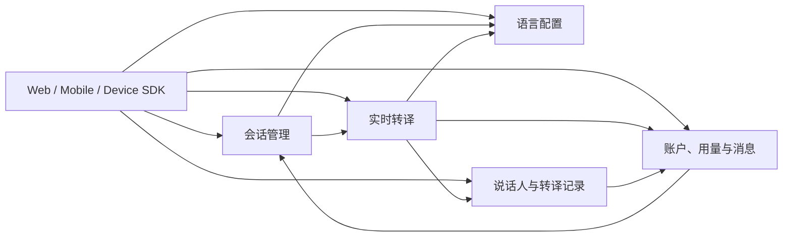

主要交接关系如下：

- 账户模块提供可信 `account_id`，会话、记录、用量和消息都以账户归属为授权边界。
- 会话管理模块创建业务会话，并协调语言配置和 Realtime 的启动、停止与状态读取。
- 语言配置模块管理双向语言对；实时转译模块在每个 Turn 开始时读取一次配置快照。
- 实时转译模块向记录模块提交 `FinalTurn`，向用量模块提交 `UsageFact`。
- 记录模块保存 final Turn；消息模块只读取已保存的 final Turn，并生成不可变消息快照。

## 3. 公共接口约定

### 3.1 接口类型

| 接口类型 | 用途 | 协议 |
| --- | --- | --- |
| 业务 REST API | 账户、会话、配置、记录、用量和消息操作 | HTTPS + JSON |
| Realtime 控制接口 | Pipeline 启停、Runtime 查询、WebRTC 信令 | HTTPS + JSON |
| 媒体通道 | 麦克风上行与 TTS 音频下行 | WebRTC Audio Track |
| 实时事件通道 | 播放状态等客户端实时事件 | WebRTC DataChannel |
| 跨模块事件 | FinalTurn、UsageFact、消息投递任务 | PostgreSQL Outbox / Valkey Stream |

### 3.2 鉴权与请求上下文

- 业务 API 使用 `Authorization: Bearer <access_token>`。
- Realtime 接口使用与 Session 绑定的短期 realtime ticket。
- `account_id` 必须来自服务端验证后的身份上下文，客户端请求体或自定义请求头不能作为授权依据。
- 写操作使用 `Idempotency-Key` 表达请求幂等身份。
- `X-Request-ID` 用于请求追踪，并应贯穿 API、Realtime 和异步事件。

### 3.3 错误响应

业务接口统一采用以下错误结构：

```json
{
  "error": {
    "code": "session_state_conflict",
    "message": "voice session state does not allow this operation",
    "request_id": "req_01...",
    "retryable": false,
    "details": {}
  }
}
```

错误码应稳定、可供客户端判断；`message` 用于展示或诊断，客户端不应通过解析错误文案决定业务分支。

## 4. 会话管理模块

### 4.1 模块职责

会话管理模块负责业务会话的完整生命周期：

- 创建并持久化语音会话；
- 记录会话所属账户、终端能力和音频配置；
- 在启动前检查语言配置和 WebRTC 连接是否就绪；
- 调用 Realtime 启动或停止媒体 Pipeline；
- 提供会话详情、列表和状态快照；
- 保证同一会话启动和结束操作的幂等性。

会话管理模块不处理音频流，不维护 PeerConnection，也不自行维护 ASR、翻译、TTS 或播放状态。

### 4.2 核心领域对象

#### VoiceSession

| 字段 | 类型 | 含义 |
| --- | --- | --- |
| `id` | string | 会话唯一标识 |
| `account_id` | string | 会话所属账户 |
| `status` | enum | `created`、`active`、`ended`、`failed` |
| `audio_config` | object | 编码、采样率、声道及音频处理能力 |
| `capabilities` | object | WebRTC、DataChannel、麦克风、扬声器、说话人区分能力 |
| `started_at` | datetime? | 会话启动时间 |
| `ended_at` | datetime? | 会话结束时间 |
| `created_at` | datetime | 会话创建时间 |

#### SessionStateSnapshot

状态快照在业务会话信息上组合 Realtime 的只读状态：

- `status`：业务会话状态；
- `runtime_state`：实时 Pipeline 状态；
- `current_turn_id`：当前 Turn；
- `current_playback_id`：当前播放任务；
- `last_error_code`：最近的 Runtime 错误；
- `runtime_updated_at`：Realtime 状态更新时间。

### 4.3 对外 HTTP 接口

| 方法 | 路径 | 请求 | 响应 |
| --- | --- | --- | --- |
| `POST` | `/api/v1/voice-sessions` | `audio_config?`、`capabilities` | `201 VoiceSession` |
| `POST` | `/api/v1/voice-sessions/{id}/start` | 空请求体、`Idempotency-Key` | `200 VoiceSession` |
| `POST` | `/api/v1/voice-sessions/{id}/end` | `reason?`、`Idempotency-Key` | `200 VoiceSession` |
| `GET` | `/api/v1/voice-sessions/{id}` | Session ID | `200 VoiceSessionDetail` |
| `GET` | `/api/v1/voice-sessions` | `status?`、`cursor?`、`limit?` | `200 VoiceSessionList` |
| `GET` | `/api/v1/voice-sessions/{id}/state` | Session ID | `200 SessionStateSnapshot` |

会话默认音频配置为 Opus、48 kHz、单声道。结束原因包括：

- `user_requested`；
- `operator_cancelled`；
- `client_disconnected`。

### 4.4 模块内部接口

| 接口 | 提供方 | 用途 |
| --- | --- | --- |
| `LanguageConfigReader.GetCurrentConfig(sessionID)` | 语言配置模块 | 启动前校验 active 双语配置 |
| `WebRTCConnectionReader.GetConnection(sessionID)` | 实时转译模块 | 启动前校验连接是否为 `connected` |
| `RealtimeLifecycle.Start(command)` | 实时转译模块 | 启动媒体 Pipeline |
| `RealtimeLifecycle.Stop(command)` | 实时转译模块 | 停止 Pipeline 并关闭连接 |
| `RealtimeLifecycle.GetRuntimeState(sessionID)` | 实时转译模块 | 获取 Runtime 快照 |
| `SessionReader.GetSession(sessionID)` | 会话管理模块 | 向可信内部模块提供业务会话快照 |

### 4.5 会话启动时序

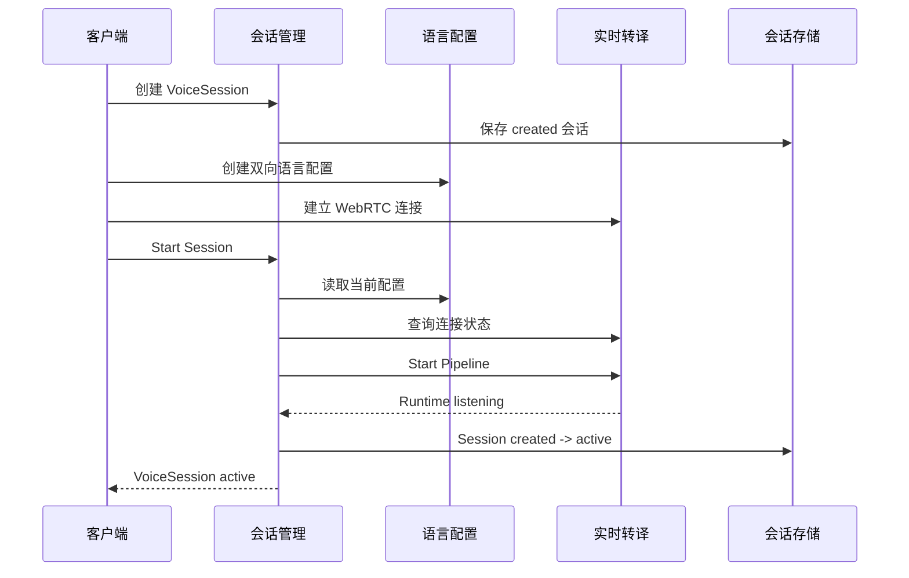

### 4.6 业务会话状态机

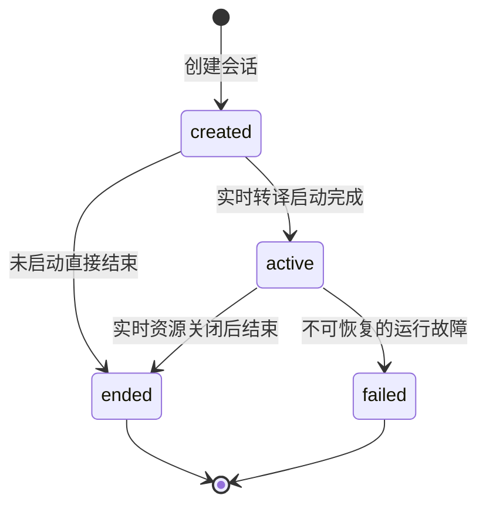

业务会话状态、Realtime Runtime 状态和 WebRTC Connection 状态是三套独立状态，不能互相替代。

## 5. 语言配置模块

### 5.1 模块职责

语言配置模块负责：

- 提供系统支持的语言目录；
- 为每个会话创建双向语言配置；
- 保存语言配置历史版本；
- 支持会话期间切换语言配置；
- 为会话启动和实时 Turn 提供当前配置快照。

### 5.2 核心领域对象

#### SupportedLanguage

| 字段 | 含义 |
| --- | --- |
| `language_code` | BCP-47 语言代码 |
| `display_name` | 本地化语言名称 |
| `display_name_en` | 英文名称 |
| `supports_as_source` | 是否可作为源语言 |
| `supports_as_target` | 是否可作为目标语言 |

#### LanguageConfig

| 字段 | 含义 |
| --- | --- |
| `id` | 配置 ID |
| `session_id` | 所属会话 |
| `version` | 配置版本号 |
| `language_pairs` | 显式翻译方向列表 |
| `status` | `active`、`superseded`、`expired` |
| `effective_from` | 生效时间 |
| `effective_until` | 失效时间 |
| `created_by` | 创建账户 |
| `created_at` | 创建时间 |

首期双语配置应包含两个互为反向的方向，例如：

```json
{
  "languages": [
    { "source": "zh-CN", "target": "en-US" },
    { "source": "en-US", "target": "zh-CN" }
  ],
  "expected_version": 2
}
```

### 5.3 对外 HTTP 接口

| 方法 | 路径 | 请求 | 响应 |
| --- | --- | --- | --- |
| `GET` | `/api/v1/languages` | `active=true|false` | `200 SupportedLanguage[]` |
| `GET` | `/api/v1/voice-sessions/{id}/language-config` | Session ID | `200 LanguageConfig` |
| `POST` | `/api/v1/voice-sessions/{id}/language-configs` | `languages`、`expected_version?` | `201 LanguageConfig` |
| `GET` | `/api/v1/voice-sessions/{id}/language-configs` | `cursor?`、`limit?` | `200 LanguageConfigList` |

### 5.4 内部快照接口

```text
GetCurrentConfig(ctx, sessionID) -> LanguageConfigSnapshot
```

`LanguageConfigSnapshot` 至少包含：

- `session_id`；
- `version`；
- `language_pairs`；
- `status`；
- `effective_from`；
- `updated_at`。

实时转译模块在 Turn 开始时读取一次并复制快照。会话中途切换配置时，正在处理的 Turn 继续使用原版本，后续 Turn 使用新版本。

### 5.5 配置版本状态机

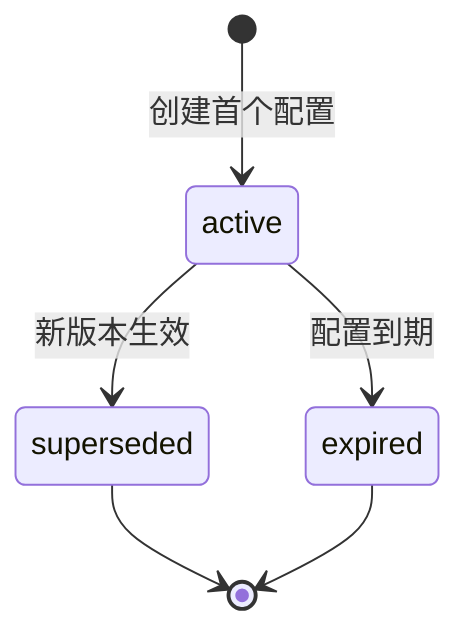

## 6. 实时转译模块

### 6.1 模块职责

实时转译模块负责媒体面全过程：

- 校验 realtime ticket；
- 交换 WebRTC SDP 和 ICE candidate；
- 管理 PeerConnection、DataChannel 和 Audio Track；
- 接收 Opus 音频并转换为内部 PCM；
- 执行 VAD 和完整语音段切分；
- 调用 ASR、翻译和 TTS Provider；
- 管理 Turn、播放任务和 Runtime 状态；
- 发布 FinalTurn、UsageFact 和实时播放事件。

实时转译模块不修改账户、业务会话、语言配置和历史记录的持久化状态。

### 6.2 Realtime 控制接口

| 方法 | 路径 | 请求 | 响应 |
| --- | --- | --- | --- |
| `POST` | `/realtime/v1/sessions/{session_id}/start` | `operation_id`、`trace_id`、`started_by` | RuntimeSnapshot |
| `POST` | `/realtime/v1/sessions/{session_id}/stop` | `trace_id`、`reason`、`ended_at` | RuntimeSnapshot |
| `GET` | `/realtime/v1/sessions/{session_id}/runtime` | Session ID | RuntimeSnapshot |
| `GET` | `/realtime/v1/sessions/{session_id}/connection` | Session ID | ConnectionSnapshot |
| `GET` | `/realtime/v1/sessions/{session_id}/webrtc/config` | Session ID | WebRTCConfig |
| `POST` | `/realtime/v1/sessions/{session_id}/webrtc/offer` | SDP Offer | SDP Answer |
| `POST` | `/realtime/v1/sessions/{session_id}/ice-candidates` | ICE Candidate 列表 | CandidateResponse |

### 6.3 Provider 接口

Provider 接口由调用方定义，不向核心业务暴露第三方 SDK 类型。

#### ASR Provider

```text
StartStream(ctx, StreamRequest) -> ASRStream
ASRStream.PushAudio(ctx, pcm)
ASRStream.Finish(ctx) -> FinalResult
```

ASR FinalResult 应包含识别文本、源语言、Provider、模型、音频时长、说话人线索和用量信息。

#### Translation Provider

```text
Translate(ctx, Request) -> TranslationResult
```

输入为 final 原文、源语言、目标语言、Session ID 和 Turn ID；输出为 final 译文及 Token/费用信息。

#### TTS Provider

```text
StartStream(ctx, Request) -> TTSStream
TTSStream.Chunks() -> AudioChunk stream
TTSStream.Finish(ctx) -> TTSResult
```

TTS 只接收 final 译文，不处理 ASR partial 或翻译草稿。

### 6.4 媒体格式

| 方向 | 格式 |
| --- | --- |
| 客户端上行 | WebRTC Opus RTP，48 kHz，单声道 |
| 内部识别音频 | 16 kHz，单声道，16-bit little-endian PCM |
| TTS Provider 输出 | 24 kHz，单声道 PCM |
| 客户端下行 | WebRTC `audio/L16`，24 kHz，单声道 |

### 6.5 Turn 数据模型

一个 Turn 表示一次完整句级语音处理，包含：

| 字段 | 含义 |
| --- | --- |
| `turn_id` | Turn 唯一标识 |
| `session_id` | 所属会话 |
| `account_id` | 会话所属账户 |
| `sequence_no` | 会话内递增序号 |
| `language_config` | Turn 开始时固定的配置快照 |
| `started_at` | Turn 开始时间 |
| `trace_id` | 跨模块追踪标识 |

### 6.6 单 Turn 处理时序

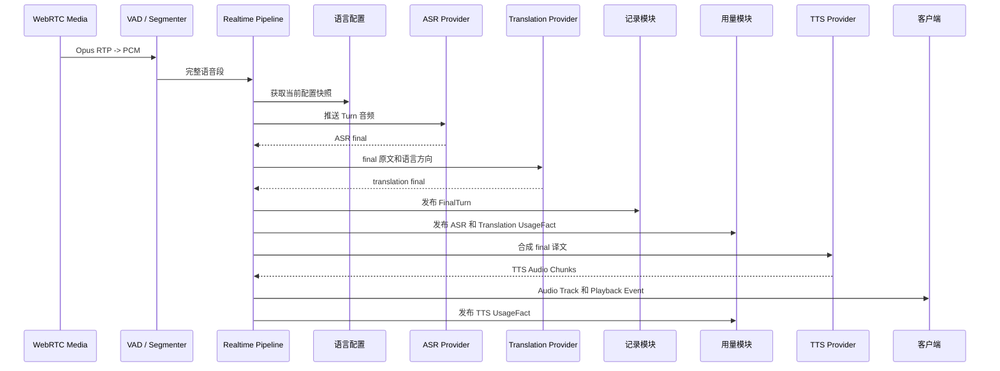

### 6.7 Runtime 状态机

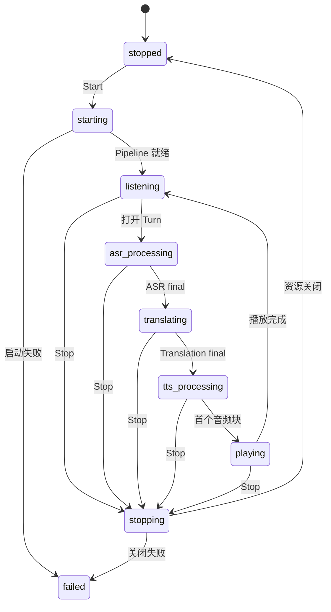

### 6.8 WebRTC Connection 状态机

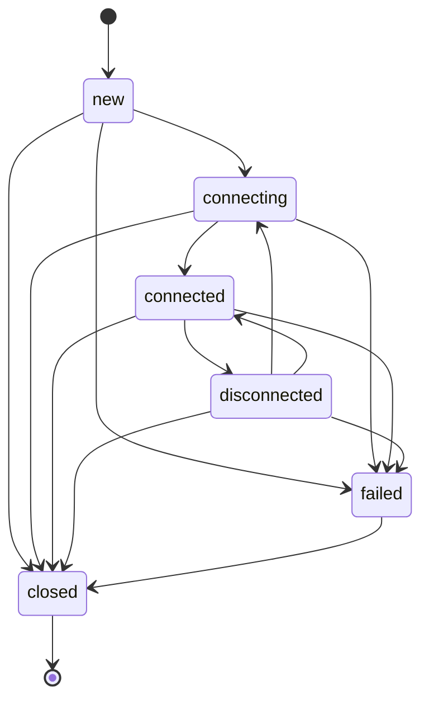

只有 `connected` 状态表示 WebRTC 已满足会话启动条件。

### 6.9 DataChannel 事件

实时事件使用 `translation-events` DataChannel。播放事件统一包含：

- `event_id`；
- `type`；
- `session_id`；
- `turn_id`；
- `playback_id`；
- `sequence_no`；
- `reason?`；
- `occurred_at`。

事件类型包括：

- `playback.started`；
- `playback.finished`；
- `playback.interrupted`；
- `playback.cancelled`。

## 7. 说话人与转译记录模块

### 7.1 模块职责

该模块负责：

- 维护 Session 范围内的临时说话人 Participant；
- 接收并持久化 Realtime 产生的 FinalTurn；
- 保存原文、译文、语言方向、配置版本和说话人快照；
- 支持说话人映射和 Turn 归属修正；
- 提供会话记录和账户级翻译历史查询；
- 向消息模块提供已授权的 final Turn 快照。

### 7.2 Participant 数据模型

| 字段 | 含义 |
| --- | --- |
| `participant_id` | 临时说话人 ID |
| `session_id` | 所属会话 |
| `speaker_code` | 会话范围内稳定展示代码 |
| `display_name` | 显示名称 |
| `provider_speaker_id` | Provider 或聚类结果的会话内标识 |
| `voice_profile_id` | 可选语音档案引用 |
| `confidence` | 识别置信度 |

Participant 只在一个 Session 内有效，不表示跨会话的真实身份，也不保存原始声纹数据。

### 7.3 VoiceTurn 数据模型

| 字段组 | 主要字段 |
| --- | --- |
| 身份 | `id`、`session_id`、`sequence_no` |
| 说话人 | `participant_id?`、`speaker_code`、`display_name?`、`speaker_confidence?` |
| 归属状态 | `attribution_status`、`corrected_by?`、`corrected_at?` |
| 语言 | `source_language`、`target_language`、`language_config_version` |
| 正文 | `source_text`、`translated_text` |
| 时间 | `started_at`、`ended_at`、`created_at` |

正文、语言方向、配置版本和 Turn 序号在 FinalTurn 创建后保持不可变；归属字段通过专用接口调整。

### 7.4 对外 HTTP 接口

| 方法 | 路径 | 请求 | 响应 |
| --- | --- | --- | --- |
| `GET` | `/api/v1/voice-sessions/{id}/participants` | `cursor?`、`limit?` | ParticipantList |
| `PATCH` | `/api/v1/voice-sessions/{id}/participants/{participant_id}` | Participant 可修改字段 | Participant |
| `GET` | `/api/v1/voice-sessions/{id}/turns` | 分页、归属、语言和时间筛选 | VoiceTurnList |
| `GET` | `/api/v1/voice-turns/{id}` | Turn ID | VoiceTurn |
| `PATCH` | `/api/v1/voice-turns/{id}/attribution` | `participant_id`、归属状态、置信度 | VoiceTurn |
| `GET` | `/api/v1/translation-history` | Session、说话人、语言、时间和分页筛选 | VoiceTurnList |

### 7.5 FinalTurn 事件接口

Topic：`translation.final`
版本：`event_version=1`

```json
{
  "event_version": 1,
  "event_id": "final_turn_...",
  "trace_id": "req_...",
  "turn_id": "turn_...",
  "session_id": "vs_...",
  "participant_id": null,
  "sequence_no": 12,
  "source_language": "zh-CN",
  "target_language": "en-US",
  "language_config_version": 3,
  "source_text": "你好",
  "translated_text": "Hello",
  "speaker_code": "speaker_pending",
  "speaker_label_snapshot": null,
  "attribution_status": "pending",
  "started_at": "2026-07-31T10:00:00Z",
  "ended_at": "2026-07-31T10:00:02Z",
  "occurred_at": "2026-07-31T10:00:03Z"
}
```

FinalTurn 在 translation final 成功后发布，不等待 TTS 接收或播放完成。ASR partial 和翻译草稿不进入该事件。

### 7.6 FinalTurn 持久化时序

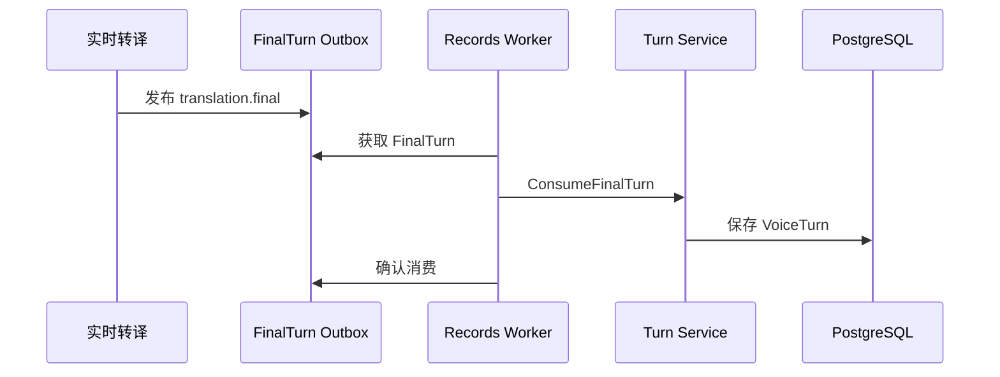

### 7.7 说话人归属状态机

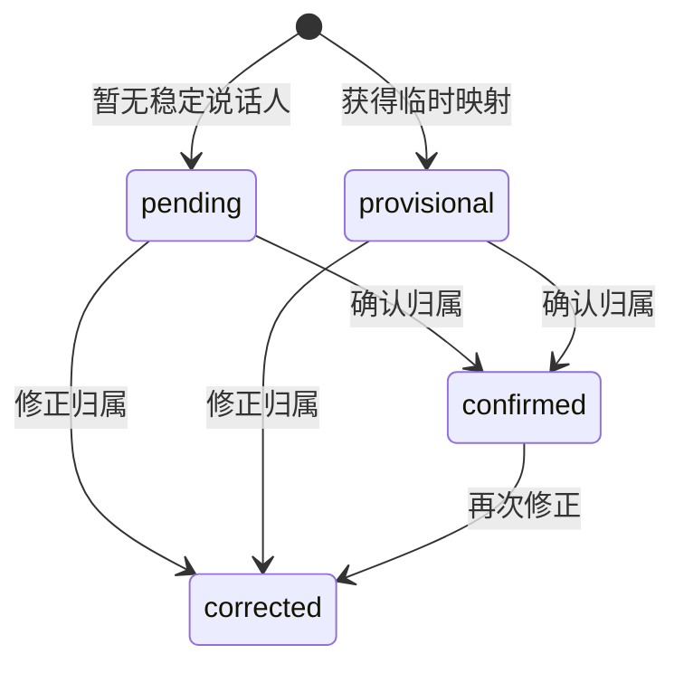

`participant_id` 可以为空，此时 `attribution_status` 为 `pending`，实时翻译不需要等待说话人最终确认。

## 8. 账户、用量与消息投递模块

该模块包含三个相互关联的子域：账户认证、用量记录、消息投递。

### 8.1 账户子域

### 职责

- 创建匿名账户；
- 使用手机号验证码完成注册或登录；
- 将匿名账户合并到注册账户；
- 签发和刷新 Access Token、Refresh Token；
- 注销登录会话；
- 为其他模块提供可信账户身份与账户继承关系。

### 核心对象

| 对象 | 说明 |
| --- | --- |
| Account | 稳定业务身份，类型为 `anonymous` 或 `registered` |
| AccountSession | 可撤销登录会话，保存 Refresh Token 哈希和过期时间 |
| PhoneChallenge | 手机验证码挑战，保存摘要、有效期和尝试次数 |
| Tokens | Access Token、Refresh Token 和过期时间 |

### HTTP 接口

| 方法 | 路径 | 请求 | 响应 |
| --- | --- | --- | --- |
| `POST` | `/api/v1/auth/anonymous` | 空 | `201 AuthResult` |
| `POST` | `/api/v1/auth/verification-codes` | `phone` | `202 challenge_id` |
| `POST` | `/api/v1/auth/phone/login` | `challenge_id`、`code`、`anonymous_account_id?` | `200 AuthResult` |
| `POST` | `/api/v1/auth/token/refresh` | `refresh_token` | `200 AuthResult` |
| `POST` | `/api/v1/auth/logout` | `refresh_token` | `204` |
| `GET` | `/api/v1/account/me` | Bearer Token | `200 Account` |

### 8.2 用量子域

### 职责

- 接收 Realtime 各 Provider 阶段的 UsageFact；
- 按事件幂等身份记录不可变用量事实；
- 按 Session 或账户时间范围汇总 Token、音频时长和费用；
- 校验 UsageFact 的账户与 Session 归属一致。

### UsageFact 事件

Topic：`usage.recorded`
版本：`event_version=1`

| 字段 | 含义 |
| --- | --- |
| `id` | 用量事实 ID |
| `idempotency_key` | `usage:{turn_id}:{service_type}` |
| `account_id` | 账户 ID |
| `session_id` | 会话 ID |
| `turn_id` | Turn ID |
| `service_type` | `asr`、`translation`、`tts`、`diarization` |
| `provider`、`model` | Provider 与模型 |
| `input_tokens`、`output_tokens` | Token 用量 |
| `audio_duration_ms` | 音频用量 |
| `cost_amount`、`currency` | 费用与币种 |
| `occurred_at` | 发生时间 |

### HTTP 接口

| 方法 | 路径 | 请求 | 响应 |
| --- | --- | --- | --- |
| `GET` | `/api/v1/voice-sessions/{id}/usage` | Session ID | UsageSummary |
| `GET` | `/api/v1/usage/summary` | `period_start`、`period_end` | UsageSummary |

### 用量记录时序

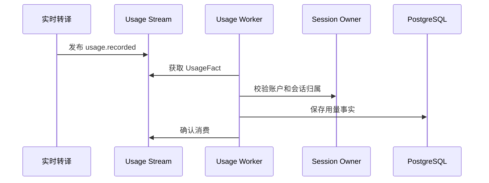

### 8.3 消息投递子域

### 职责

- 管理账户的消息偏好和已验证投递目标；
- 从记录模块读取 final Turn；
- 创建不可变消息内容快照；
- 创建和跟踪 DeliveryAttempt；
- 通过 Email 或 WeChat Work Provider 异步投递；
- 提供消息状态查询和失败重试入口。

### 核心对象

#### Message

| 字段 | 含义 |
| --- | --- |
| `id` | 消息 ID |
| `account_id` | 所属账户 |
| `channel` | `email` 或 `wechat` |
| `destination_ref` | 已验证目标引用 |
| `snapshot_version` | 消息快照版本 |
| `turns` | 不可变 FinalTurnSnapshot 数组 |
| `status` | `queued`、`sending`、`sent`、`failed`、`retrying`、`cancelled` |
| `attempts` | 尝试次数 |
| `last_error_code` | 最近投递错误 |

#### DeliveryAttempt

每次 Provider 调用对应一个独立 Attempt，状态为：

- `queued`；
- `sending`；
- `succeeded`；
- `failed`。

### 消息 HTTP 接口

| 方法 | 路径 | 请求 | 响应 |
| --- | --- | --- | --- |
| `POST` | `/api/v1/outbound-messages` | `channel`、`destination_ref`、`turn_ids` | `202 Message` |
| `GET` | `/api/v1/outbound-messages/{message_id}` | Message ID | `200 Message` |
| `POST` | `/api/v1/outbound-deliveries/{message_id}/retry` | `Idempotency-Key` | `202 Message` |
| `GET` | `/api/v1/account/message-preferences` | Bearer Token | PreferenceList |
| `PUT` | `/api/v1/account/message-preferences/{channel}` | `enabled` | Preference |
| `GET` | `/api/v1/account/message-targets` | `channel?` | MessageTargetList |
| `POST` | `/api/v1/account/message-targets/email/verification-codes` | `email`、`destination_ref?` | `202` |
| `POST` | `/api/v1/account/message-targets/email/bind` | `token` | MessageTarget |
| `DELETE` | `/api/v1/account/message-targets/email/{destination_ref}` | 目标引用 | `204` |
| `POST` | `/api/v1/account/message-targets/wechat/bind` | OAuth `code` | MessageTarget |
| `DELETE` | `/api/v1/account/message-targets/wechat/{destination_ref}` | 目标引用 | `204` |

### 消息投递时序

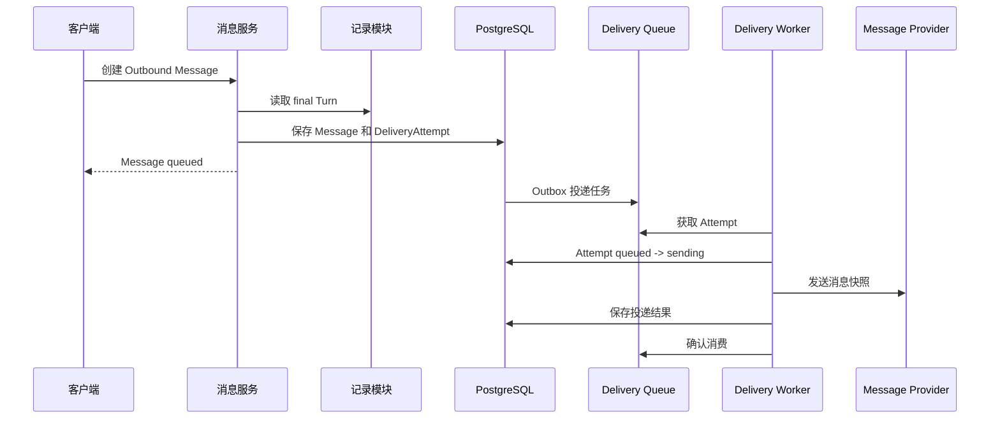

### Message 状态机

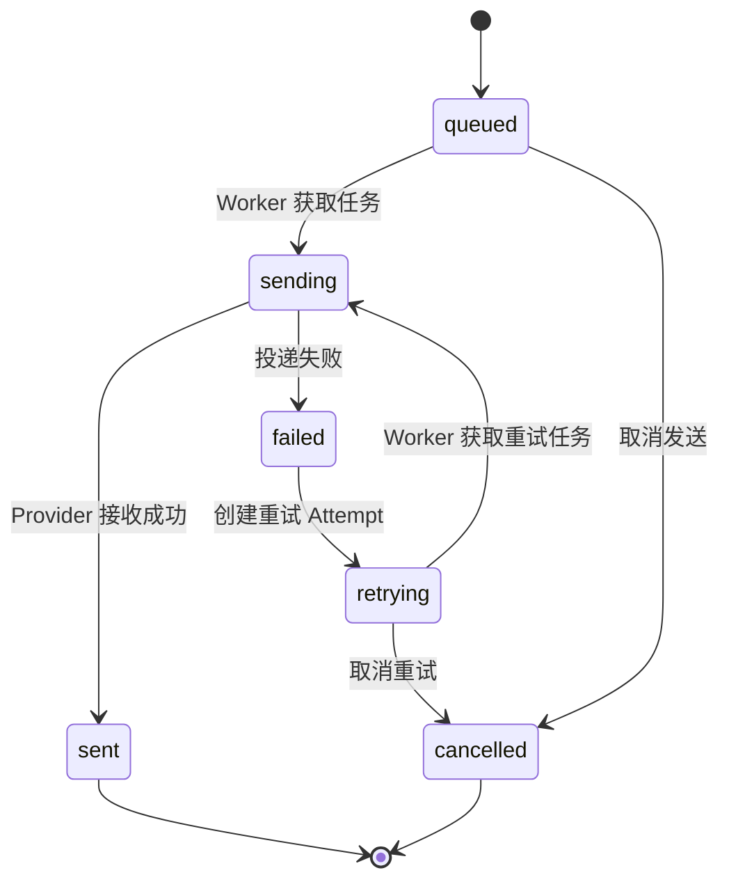

## 9. 跨模块完整业务流程

### 9.1 会话创建到实时转译

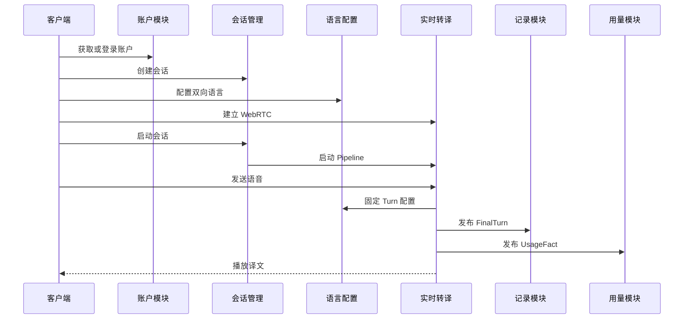

### 9.2 会话结束

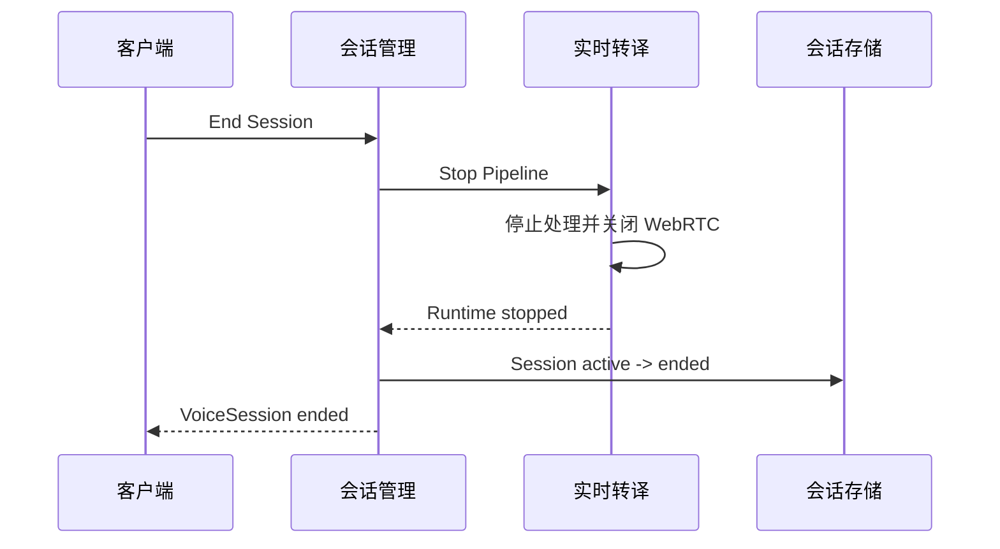

## 10. 数据归属与一致性边界

| 数据 | 事实来源 | 主要消费者 |
| --- | --- | --- |
| Account | 账户模块 | 所有业务模块 |
| VoiceSession 业务状态 | 会话管理模块 | 客户端、Realtime、记录和用量模块 |
| LanguageConfig | 语言配置模块 | 会话管理、Realtime |
| RuntimeState | 实时转译模块 | 会话管理、客户端 |
| ConnectionState | 实时转译模块 | 会话管理、客户端 |
| Participant / VoiceTurn | 记录模块 | 客户端、消息模块 |
| UsageFact / UsageSummary | 用量模块 | 客户端、运营统计 |
| Message / DeliveryAttempt | 消息模块 | 客户端、投递 Worker |

关键一致性约束：

- 一个数据对象只有一个权威写入模块；其他模块通过接口读取或通过事件提交事实。
- 配置版本、FinalTurn、UsageFact 和消息快照都保留生成时的版本与上下文，不回写为后续最新值。
- 业务会话结束前，Realtime 应完成 Pipeline 和连接关闭。
- FinalTurn 在翻译完成后产生，不依赖 TTS 和播放是否成功。
- 消息内容基于已持久化的 final Turn，不直接读取实时处理中间结果。

## 11. 设计依据

- Issue #83：说话人与转译记录；
- Issue #84：实时转译前端接口；
- Issue #85：实时转译后端接口；
- Issue #86：会话管理；
- Issue #87：账户、用量与消息投递；
- Issue #88：语言配置；
- `xe6-tsy/services/api`；
- `xe6-tsy/services/realtime-audio`；
- `xe6-tsy/packages/contracts`。

## 12. 当前实现差距

当前代码与上述整体架构相比，还存在以下未闭环部分：

1. `services/realtime-audio` 已包含控制面、WebRTC、Pipeline 和 Provider 组件，但缺少完整可部署运行入口。
2. Web 目录目前以产品和页面职责说明为主，尚未形成实际可运行的前端工程和接口消费实现。
3. API 内部具备 realtime ticket 签发能力，但尚无提供给 Web、Mobile 或 Device SDK 的公开取票接口。
4. DataChannel 当前主要承载 playback 事件，尚未形成 ASR partial、ASR final 和 translation final 的完整客户端事件契约。
5. Realtime 内部已有播放打断能力，但尚无公开的 interrupt HTTP 或 DataChannel 命令接口。
6. Participant 更新和 Turn 归属修正需要可信 system actor，当前生产 HTTP 装配尚未提供该身份入口。
7. 消息目标和底层 Provider 已包含 WeChat Work 能力，但创建消息和偏好设置的公开 HTTP 接口仍主要按 Email 限制。
8. LanguageConfig 的 `expired` 和 Message 的 `cancelled` 已进入领域模型，但公开业务流程尚未完整覆盖这些迁移。
9. 语言配置接口尚未全部并入统一 OpenAPI 契约文件。
