# Lingow 模块详细设计

## 1. 文档目标

本文档描述 Lingow 项目应具备的整体模块架构、模块职责、领域对象、接口边界、关键时序和状态模型。文档面向产品、研发、测试及后续接入方，用于统一以下认识：

- 系统由哪些业务模块组成；
- 每个模块负责什么、不负责什么；
- 模块之间通过哪些接口和事件协作；
- 一次语音转译会话如何从创建、接入、处理走到记录和消息投递；
- 业务会话、媒体运行时、WebRTC 连接等状态分别由谁维护。

Web、Mobile 和 Device SDK 是系统接入端，不作为独立业务模块。客户端负责交互、音频采集、音频播放和状态展示，业务判断与媒体处理分别由后端控制面和媒体面完成。

Lingow 首期面向线下面对面的双语沟通场景：双方通常共用一个现场设备或浏览器，由单路麦克风采集轮流发言，并通过云端完成句级识别、翻译和译文播报。该边界不同于远程多人会议，不要求两个参会端之间建立点对点媒体连接，也不把多人会议、跨会话声纹身份或边听边播的连续同传作为首期基础能力。

## 2. 总体架构

### 2.1 架构分层

Lingow 采用控制面与媒体面分离的双服务架构：

| 分层 | 主要组成 | 职责 |
| --- | --- | --- |
| 客户端接入层 | Web、Mobile、Device SDK | 用户交互、麦克风采集、WebRTC 接入、音频播放、状态展示 |
| 应用控制面 | `services/api` | 账户、业务会话、语言配置、记录、用量、消息投递 |
| 实时媒体面 | `services/realtime-audio` | WebRTC、VAD、ASR、翻译、TTS、播放控制、Runtime 状态 |
| 契约层 | `packages/contracts` | REST、Realtime、事件、错误码和跨模块数据结构 |
| 基础设施层 | PostgreSQL、Valkey、外部 Provider | 持久化、事件队列、ASR/翻译/TTS、邮件和企业微信投递 |

### 2.2 业务模块

系统按业务能力划分为五个模块：

1. 会话管理模块；
2. 语言配置模块；
3. 实时转译模块；
4. 说话人与转译记录模块；
5. 账户、用量与消息投递模块。

模块表示业务责任边界，不要求每个模块独立部署。会话、语言、记录、账户、用量和消息可以共同运行于 `services/api`；实时转译运行于 `services/realtime-audio`。

### 2.3 模块关系

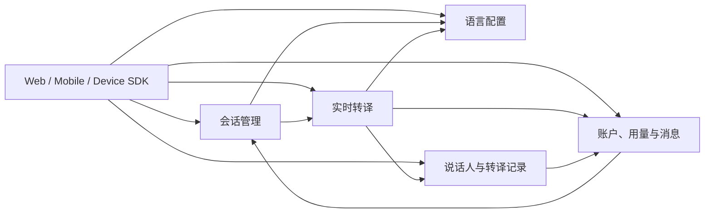

主要交接关系如下：

- 账户模块提供可信 `account_id`，会话、记录、用量和消息都以账户归属为授权边界。
- 会话管理模块创建业务会话，并协调语言配置和 Realtime 的启动、停止与状态读取。
- 语言配置模块管理双向语言对；实时转译模块在每个 Turn 开始时读取一次配置快照。
- 实时转译模块向记录模块提交 `FinalTurn`，向用量模块提交 `UsageFact`。
- 记录模块保存 final Turn；消息模块只读取已保存的 final Turn，并生成不可变消息快照。

## 3. 公共接口约定

### 3.1 接口类型

| 接口类型 | 用途 | 协议 |
| --- | --- | --- |
| 业务 REST API | 账户、会话、配置、记录、用量和消息操作 | HTTPS + JSON |
| Realtime 控制接口 | Pipeline 启停、Runtime 查询、WebRTC 信令 | HTTPS + JSON |
| 媒体通道 | 麦克风上行；可选的 Opus TTS 下行 | WebRTC Audio Track |
| 实时事件通道 | Final 字幕、PCM TTS 音频和播放状态 | WebRTC DataChannel |
| 跨模块事件 | FinalTurn、UsageFact、消息投递任务 | PostgreSQL Outbox / Valkey Stream |

### 3.2 鉴权与请求上下文

- 业务 API 使用 `Authorization: Bearer <access_token>`。
- Realtime 接口使用与 Session 绑定的短期 realtime ticket。
- `account_id` 必须来自服务端验证后的身份上下文，客户端请求体或自定义请求头不能作为授权依据。
- 写操作使用 `Idempotency-Key` 表达请求幂等身份。
- `X-Request-ID` 用于请求追踪，并应贯穿 API、Realtime 和异步事件。

### 3.3 错误响应

业务接口统一采用以下错误结构：

```json
{
  "error": {
    "code": "session_state_conflict",
    "message": "voice session state does not allow this operation",
    "request_id": "req_01...",
    "retryable": false,
    "details": {}
  }
}
```

错误码应稳定、可供客户端判断；`message` 用于展示或诊断，客户端不应通过解析错误文案决定业务分支。

## 4. 会话管理模块

### 4.1 模块职责

会话管理模块负责业务会话的完整生命周期：

- 创建并持久化语音会话；
- 记录会话所属账户、终端能力和音频配置；
- 在启动前检查语言配置和 WebRTC 连接是否就绪；
- 调用 Realtime 启动或停止媒体 Pipeline；
- 提供会话详情、列表和状态快照；
- 保证同一会话启动和结束操作的幂等性。

会话管理模块不处理音频流，不维护 PeerConnection，也不自行维护 ASR、翻译、TTS 或播放状态。

### 4.2 核心领域对象

#### VoiceSession

| 字段 | 类型 | 含义 |
| --- | --- | --- |
| `id` | string | 会话唯一标识 |
| `account_id` | string | 会话所属账户 |
| `status` | enum | `created`、`active`、`ended`、`failed` |
| `audio_config` | object | 编码、采样率、声道及音频处理能力 |
| `capabilities` | object | WebRTC、DataChannel、麦克风、扬声器、说话人区分能力 |
| `started_at` | datetime? | 会话启动时间 |
| `ended_at` | datetime? | 会话结束时间 |
| `created_at` | datetime | 会话创建时间 |

#### SessionStateSnapshot

状态快照在业务会话信息上组合 Realtime 的只读状态：

- `status`：业务会话状态；
- `runtime_state`：实时 Pipeline 状态；
- `current_turn_id`：当前 Turn；
- `current_playback_id`：当前播放任务；
- `last_error_code`：最近的 Runtime 错误；
- `runtime_updated_at`：Realtime 状态更新时间。

### 4.3 对外 HTTP 接口

| 方法 | 路径 | 请求 | 响应 |
| --- | --- | --- | --- |
| `POST` | `/api/v1/voice-sessions` | `audio_config?`、`capabilities` | `201 VoiceSession` |
| `POST` | `/api/v1/voice-sessions/{id}/start` | 空请求体、`Idempotency-Key` | `200 VoiceSession` |
| `POST` | `/api/v1/voice-sessions/{id}/end` | `reason?`、`Idempotency-Key` | `200 VoiceSession` |
| `GET` | `/api/v1/voice-sessions/{id}` | Session ID | `200 VoiceSessionDetail` |
| `GET` | `/api/v1/voice-sessions` | `status?`、`cursor?`、`limit?` | `200 VoiceSessionList` |
| `GET` | `/api/v1/voice-sessions/{id}/state` | Session ID | `200 SessionStateSnapshot` |
| `POST` | `/api/v1/voice-sessions/{id}/realtime-ticket` | Session ID | `200 RealtimeTicket` |

会话默认音频配置为 Opus、48 kHz、单声道。结束原因包括：

- `user_requested`；
- `operator_cancelled`；
- `client_disconnected`。

### 4.4 模块内部接口

| 接口 | 提供方 | 用途 |
| --- | --- | --- |
| `LanguageConfigReader.GetCurrentConfig(sessionID)` | 语言配置模块 | 启动前校验 active 双语配置 |
| `WebRTCConnectionReader.GetConnection(sessionID)` | 实时转译模块 | 启动前校验连接是否为 `connected` |
| `RealtimeLifecycle.Start(command)` | 实时转译模块 | 启动媒体 Pipeline |
| `RealtimeLifecycle.Stop(command)` | 实时转译模块 | 停止 Pipeline 并关闭连接 |
| `RealtimeLifecycle.GetRuntimeState(sessionID)` | 实时转译模块 | 获取 Runtime 快照 |
| `SessionReader.GetSession(sessionID)` | 会话管理模块 | 向可信内部模块提供业务会话快照 |

### 4.5 会话启动时序

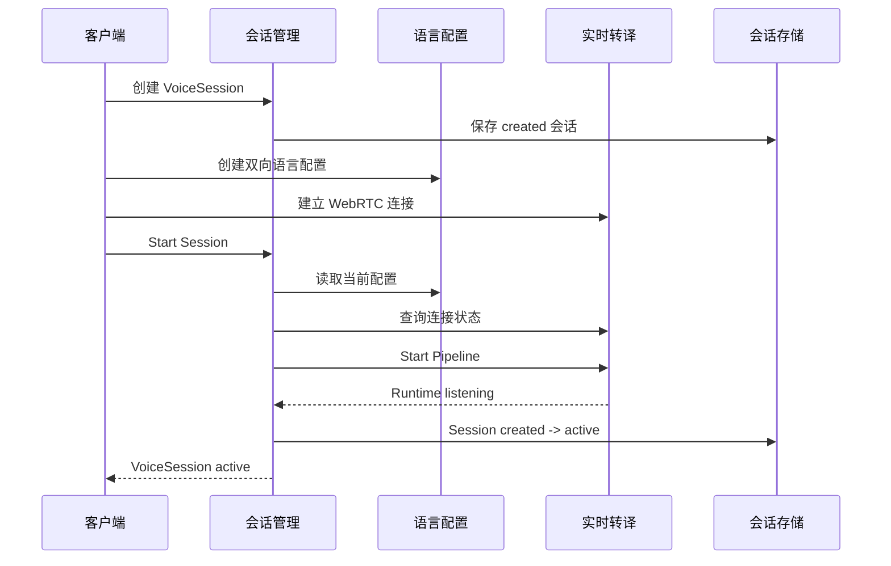

### 4.6 业务会话状态机

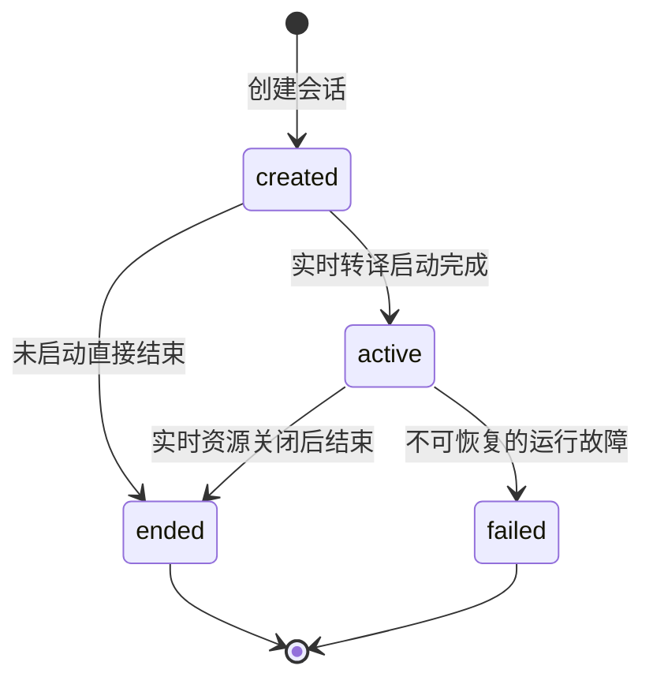

业务会话状态、Realtime Runtime 状态和 WebRTC Connection 状态是三套独立状态，不能互相替代。

### 4.7 异常处理

| 异常 | 对外语义 | 模块行为 |
| --- | --- | --- |
| 会话不存在或不属于当前账户 | `404 not_found` | 不泄露其他账户的会话信息 |
| 语言配置未就绪 | `409 language_config_not_ready` | 不启动 Realtime，不修改业务状态 |
| WebRTC 未连接 | `409 webrtc_not_ready` | 保持 `created`，客户端可重新建连后重试 |
| 同一会话重复启动 | 幂等成功或 `409 realtime_already_running` | 通过 `Idempotency-Key` 和 Start Operation 防止重复 Pipeline |
| Realtime Start 结果不确定 | `409` 或服务错误 | 查询 Runtime 并执行会话启动协调，不直接假定成功 |
| Realtime Stop 失败 | 可重试错误 | 不先写入 `ended`，保留清理意图并继续协调 |
| realtime ticket 无效或过期 | `401 unauthorized` | 拒绝信令和控制请求，客户端重新向 API 取票 |

## 5. 语言配置模块

### 5.1 模块职责

语言配置模块负责：

- 提供系统支持的语言目录；
- 为每个会话创建双向语言配置；
- 保存语言配置历史版本；
- 支持会话期间切换语言配置；
- 为会话启动和实时 Turn 提供当前配置快照。

### 5.2 核心领域对象

#### SupportedLanguage

| 字段 | 含义 |
| --- | --- |
| `language_code` | BCP-47 语言代码 |
| `display_name` | 本地化语言名称 |
| `display_name_en` | 英文名称 |
| `supports_as_source` | 是否可作为源语言 |
| `supports_as_target` | 是否可作为目标语言 |

#### LanguageConfig

| 字段 | 含义 |
| --- | --- |
| `id` | 配置 ID |
| `session_id` | 所属会话 |
| `version` | 配置版本号 |
| `language_pairs` | 显式翻译方向列表 |
| `status` | `active`、`superseded`、`expired` |
| `effective_from` | 生效时间 |
| `effective_until` | 失效时间 |
| `created_by` | 创建账户 |
| `created_at` | 创建时间 |

首期双语配置应包含两个互为反向的方向，例如：

```json
{
  "languages": [
    { "source": "zh-CN", "target": "en-US" },
    { "source": "en-US", "target": "zh-CN" }
  ],
  "expected_version": 2
}
```

### 5.3 对外 HTTP 接口

| 方法 | 路径 | 请求 | 响应 |
| --- | --- | --- | --- |
| `GET` | `/api/v1/languages` | `active=true|false` | `200 SupportedLanguage[]` |
| `GET` | `/api/v1/voice-sessions/{id}/language-config` | Session ID | `200 LanguageConfig` |
| `POST` | `/api/v1/voice-sessions/{id}/language-configs` | `languages`、`expected_version?` | `201 LanguageConfig` |
| `GET` | `/api/v1/voice-sessions/{id}/language-configs` | `cursor?`、`limit?` | `200 LanguageConfigList` |

### 5.4 内部快照接口

```text
GetCurrentConfig(ctx, sessionID) -> LanguageConfigSnapshot
```

`LanguageConfigSnapshot` 至少包含：

- `session_id`；
- `version`；
- `language_pairs`；
- `status`；
- `effective_from`；
- `updated_at`。

实时转译模块在 Turn 开始时读取一次并复制快照。会话中途切换配置时，正在处理的 Turn 继续使用原版本，后续 Turn 使用新版本。

### 5.5 配置版本状态机

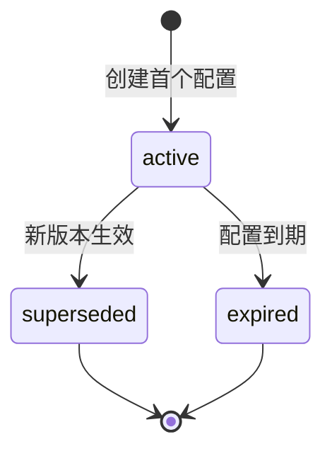

### 5.6 异常处理

| 异常 | 处理规则 |
| --- | --- |
| 不支持的语言或方向 | 返回稳定的 `unsupported_language` 类错误，不创建新版本 |
| `expected_version` 与当前版本不一致 | 返回冲突，调用方重新读取当前配置 |
| 会话不属于当前账户 | 按资源不存在处理，不泄露配置 |
| active 配置缺少有效双向语言对 | 会话不得启动，Realtime 不得回退到任意语言 |
| 会话中途更新配置 | 已打开 Turn 使用旧快照，后续 Turn 使用新版本 |

## 6. 实时转译模块

### 6.1 模块职责

实时转译模块是媒体面和句级转译流程的事实来源，负责：

- 校验与业务 Session 绑定的短期 realtime ticket；
- 交换 SDP Offer/Answer 和 ICE candidate；
- 管理每个 Session 的 PeerConnection、远端音频 Track、下行 Track 和 DataChannel；
- 将浏览器上行 Opus 解码并规范化为内部 PCM Frame；
- 执行 VAD、句末检测和最长语音段限制；
- 按 Turn 编排 ASR、翻译、FinalTurn、UsageFact 和 TTS；
- 管理 Runtime 和 Playback 状态；
- 通过持久化 Outbox 和 DataChannel 分发最终结果。

实时转译模块不修改账户、业务会话、语言配置和历史记录的权威状态。它只读取业务快照，并向其他模块提交实时处理产生的事实。

### 6.2 内部组件边界

| 组件 | 主要职责 | 关键接口 |
| --- | --- | --- |
| SignalingService | ticket 校验、Offer 和 ICE 操作编排 | `Offer`、`AddCandidates` |
| ConnectionManager | Session 与当前 PeerConnection 的绑定、状态和关闭 | `Open`、`GetCurrent`、`Close` |
| FrameSource | 从远端 Track 解码并产生 16 kHz PCM Frame | `ReadFrame`、`Close` |
| VAD Segmenter | 判定语音活动并形成完整语音段 | `Push`、`Flush` |
| TurnOpener | 分配 Turn ID 并固定语言配置快照 | `OpenTurn` |
| PipelineService | 编排 ASR、翻译、记录、用量和 TTS | `ProcessAudio`、`HandleASRFinal` |
| PlaybackService | 管理 TTS 播放生命周期和打断 | `Publish`、`Complete`、`Interrupt`、`Cancel` |
| RuntimeManager | 每个 Session 的 Pipeline 创建、激活和停止 | `Start`、`Activate`、`Stop` |
| FinalTurn/Usage Sink | 可靠或实时地分发处理事实 | `Publish` |

### 6.3 Realtime 控制接口

所有接口均使用 `Authorization: Bearer <realtime_ticket>`，ticket 只能访问其声明的 Session。

| 方法 | 路径 | 请求 | 响应 |
| --- | --- | --- | --- |
| `POST` | `/realtime/v1/sessions/{session_id}/start` | `operation_id`、`trace_id`、`started_by` | RuntimeSnapshot |
| `POST` | `/realtime/v1/sessions/{session_id}/stop` | `trace_id`、`reason`、`ended_at` | RuntimeSnapshot |
| `GET` | `/realtime/v1/sessions/{session_id}/runtime` | Session ID | RuntimeSnapshot |
| `GET` | `/realtime/v1/sessions/{session_id}/connection` | Session ID | ConnectionSnapshot |
| `GET` | `/realtime/v1/sessions/{session_id}/webrtc/config` | Session ID | WebRTCConfig |
| `POST` | `/realtime/v1/sessions/{session_id}/webrtc/offer` | `connection_id`、SDP Offer | SDP Answer |
| `POST` | `/realtime/v1/sessions/{session_id}/ice-candidates` | `connection_id`、Candidate 列表、结束标记 | CandidateResponse |

Start 和 Stop 使用独立的操作身份实现幂等。只有当前 Connection 状态为 `connected` 时，Start 才允许激活 Pipeline。

### 6.4 WebRTC 拓扑与配置

首期为一个现场客户端到云端 Realtime 服务的单连接拓扑，不是两个现场参与者之间的 P2P 连接：

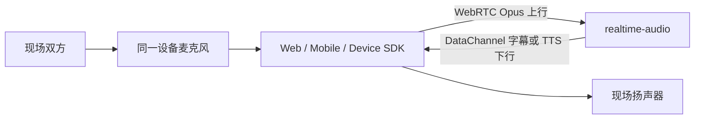

`WebRTCConfig` 向客户端返回：

- `ice_servers`；
- `ice_transport_policy`；
- DataChannel 标签和有序性；
- 上下行 Codec、采样率和声道数。

面对面场景默认优先直连云端 Realtime 服务。TURN 不是该产品形态的固定业务组件，仅在目标网络无法稳定直连时作为 ICE 中继候选；STUN/TURN 地址属于部署配置，不进入业务模块逻辑。

### 6.5 Provider 接口

Provider 接口由调用方定义，不向核心 Pipeline 暴露百炼 SDK、HTTP 或 WebSocket 类型。

#### ASR Provider

```text
StartStream(ctx, StreamRequest) -> ASRStream
ASRStream.PushAudio(ctx, pcm)
ASRStream.Events() -> ASREvent stream
ASRStream.Finish(ctx) -> FinalResult
```

`FinalResult` 包含识别文本、规范化源语言、Provider、模型、音频时长、可选 `provider_speaker_id` 和用量信息。Partial 只作为实时识别中间结果，不得直接进入翻译记录或 TTS。

#### Translation Provider

```text
Translate(ctx, Request) -> TranslationResult
```

输入为 ASR final、源语言、目标语言、Session ID 和 Turn ID；输出为 final 译文及 Token、费用和延迟信息。

#### TTS Provider

```text
StartStream(ctx, Request) -> TTSStream
TTSStream.Chunks() -> AudioChunk stream
TTSStream.Finish(ctx) -> TTSResult
```

TTS 请求包含 final 译文、目标语言、`playback_id` 和 `voice_id`。只有 final 译文可以进入 TTS。

### 6.6 百炼模型与运行配置

| 能力 | Provider 选择 | 当前百炼模型 | 主要配置 |
| --- | --- | --- | --- |
| ASR | `mock` / `aliyun` | `qwen3-asr-flash-realtime` | `ASR_MODEL`、16 kHz、WebSocket URL、Server VAD 参数 |
| 翻译 | `mock` / `aliyun` | `qwen3.6-flash` | `LLM_MODEL`、Thinking 开关、15 秒级超时 |
| TTS | `mock` / `aliyun` | `qwen3-tts-flash` | `TTS_MODEL`、`TTS_VOICE`、24 kHz、30 秒级超时 |

Provider 通过 `ASR_PROVIDER`、`LLM_PROVIDER` 和 `TTS_PROVIDER` 分别选择，三个阶段可以独立切换。进程不自动加载 `.env`；启动器负责把配置导入进程环境。生产配置不得在缺少密钥或端点时静默回退为真实成功结果。

### 6.7 VAD 与语音段设计

VAD 的职责是确定一句话的开始、结束和最大持续时间。系统允许两种互斥的边界所有权：

| 模式 | 边界所有者 | 数据流 |
| --- | --- | --- |
| 本地 VAD | Realtime Segmenter | PCM Frame 先在本地切段，再为完整语音段启动 ASR |
| ASR Server VAD | 百炼实时 ASR | PCM 连续推入 ASR，由 `speech_started`、`speech_stopped` 和 transcription final 确定 Turn |

同一条音频链路不得同时由本地 VAD 和 Server VAD 重复完成句末切分，否则会产生重复 final、提前截断或额外等待。

当前运行入口采用本地 VAD：

- `EnergySpeechClassifier` 按 16-bit PCM 的归一化 RMS 判定语音；
- 能量阈值为 `0.035`；
- 连续静音 `800ms` 形成句末；
- 单个语音段最长 `12s`。

百炼 `qwen3-asr-flash-realtime` 适配器同时支持 `server_vad`，参数由 `ASR_VAD_THRESHOLD` 和 `ASR_SILENCE_DURATION_MS` 提供；运行入口在 `ASR_SERVER_VAD` 未显式设置时关闭 Server VAD，以保证本地 Segmenter 是唯一边界所有者。

### 6.8 媒体格式与 TTS 下行

| 环节 | 格式或行为 |
| --- | --- |
| 客户端上行 | WebRTC Opus RTP，浏览器协商时钟通常为 48 kHz，单声道 |
| 内部 Frame | 16 kHz、单声道、16-bit little-endian PCM |
| ASR 输入 | 16 kHz PCM |
| TTS Provider 输出 | 默认 24 kHz、单声道 PCM 或音频容器字节 |

`REALTIME_TTS_DOWNLINK` 决定译音下行方式：

| 模式 | 下行路径 | 播放语义 |
| --- | --- | --- |
| `none` | 不下发音频 | 字幕模式，真实 TTS 被替换为 Mock，音频 Sink 丢弃 |
| `pcm` | `tts.audio` DataChannel 消息 | 后端缓存完整 Playback，拆成不超过 8 KiB 的 Base64 片段；前端收齐 `final=true` 后拼接并播放 |
| `opus` | WebRTC Opus Audio Track | 设计目标为 PCM 按 20ms 编码并随生成随发送 |

PCM DataChannel 模式是真实可听链路，但其语义是整段 TTS 完成后播放，不是逐块流式播音。Opus Track 的接口和播放状态链路已经存在，实际编码能力见末尾实现差距。

### 6.9 音色选择

TTS 端口已经支持请求级 `voice_id`，百炼适配器按照以下优先级选择音色：

```text
TTS Request.voice_id
  -> ProviderConfig.TTS.Voice
  -> Cherry
```

当前 Runtime 在进程启动时读取 `TTS_VOICE`，将同一个 `voice_id` 注入所有 Session 和 Turn。目标语言同时映射为百炼 `language_type`，中文和英文分别使用 `Chinese` 与 `English`。

### 6.10 Turn 数据模型

一个 Turn 表示一次完整句级语音处理，包含：

| 字段 | 含义 |
| --- | --- |
| `turn_id` | Turn 唯一标识 |
| `session_id` | 所属会话 |
| `account_id` | 会话所属账户 |
| `sequence_no` | 会话内递增序号 |
| `language_config` | Turn 开始时固定的配置快照 |
| `started_at` | Turn 开始时间 |
| `trace_id` | 跨模块追踪标识 |

双向配置包含两个互逆方向。当 ASR 未强制指定源语言时，由 ASR 返回检测语言，Pipeline 再从 Turn 的语言配置快照中选择对应目标语言。

### 6.11 单 Turn 处理时序

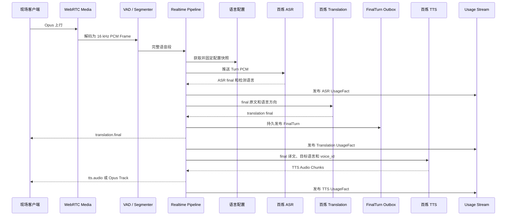

FinalTurn 的接受点在 TTS 之前。FinalTurn 已持久发布后，即使 TTS 或播放失败，也不能重新执行 ASR 和翻译来制造重复 Turn。

### 6.12 Runtime 状态机

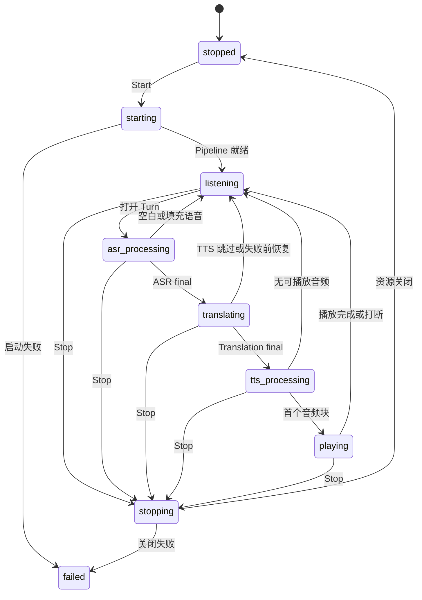

RuntimeSnapshot 同时携带 `current_turn_id`、`current_playback_id`、`last_error_code` 和更新时间。Pipeline 状态由 Realtime 维护，API 只读取快照。

### 6.13 WebRTC Connection 状态机

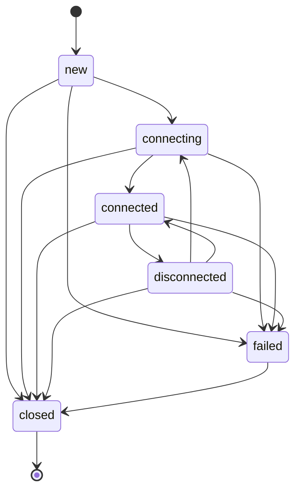

只有 `connected` 状态表示 WebRTC 已满足会话启动条件。每个 Session 同时只有一个当前 Connection；重复创建连接不得覆盖仍在使用的 PeerConnection。

### 6.14 DataChannel 事件

实时事件使用有序的 `translation-events` DataChannel：

| 事件 | 关键字段 | 用途 |
| --- | --- | --- |
| `translation.final` | `turn_id`、原文、译文、语言方向、配置版本、序号 | 客户端展示最终字幕 |
| `tts.audio` | `playback_id`、采样率、编码、Base64 音频、分片序号、`final` | PCM 模式下传输整段译音 |
| `playback.started` | `playback_id`、`turn_id`、序号、时间 | 表示播放开始 |
| `playback.finished` | `playback_id`、结束时间 | 表示正常播放完成 |
| `playback.interrupted` | `playback_id`、`reason` | 表示检测到用户发言后的打断 |
| `playback.cancelled` | `playback_id`、`reason` | 表示 Provider 或会话停止导致的取消 |

ASR partial 目前保留在 ASR Provider 与 Pipeline 内部，不属于客户端稳定事件契约。

### 6.15 异常处理

| 异常 | 处理规则 |
| --- | --- |
| ticket 缺失、过期或 Session 不匹配 | 返回 `401`，不创建或修改连接 |
| Offer、Candidate 或连接身份冲突 | 返回 `400/409`，保留当前权威 Connection |
| WebRTC 未连接时 Start | 返回 `webrtc_connection_not_ready`，不启动 Pipeline |
| 远端 Track 关闭或解码失败 | 终止当前 Pipeline，Runtime 进入 `failed` 并回收媒体资源 |
| VAD 收到无效 PCM 或非单调时间戳 | 拒绝 Frame，避免形成错误 Turn |
| ASR final 为空或仅为填充词 | 丢弃该语音段并恢复 `listening` |
| ASR 检测语言不在配置方向中 | 返回 `unsupported_source_language`，不调用翻译 |
| ASR 或翻译 Provider 失败 | 当前 Turn 失败，不发布 FinalTurn，不进入 TTS |
| FinalTurn 持久化失败 | 不向浏览器宣告成功，不继续 TTS |
| FinalTurn 已接受后 TTS 失败 | 保留已保存字幕，取消 Playback，不重跑 ASR/翻译 |
| DataChannel 关闭或慢消费者 | 实时字幕作为尽力投递，不破坏已经持久化的 FinalTurn |
| Stop 被重复调用 | 幂等停止 Pipeline、Provider Context、DataChannel、Track 和 PeerConnection |

## 7. 说话人与转译记录模块

### 7.1 模块职责

该模块负责：

- 维护 Session 范围内的临时说话人 Participant；
- 接收并持久化 Realtime 产生的 FinalTurn；
- 保存原文、译文、语言方向、配置版本和说话人快照；
- 支持说话人映射和 Turn 归属修正；
- 提供会话记录和账户级翻译历史查询；
- 向消息模块提供已授权的 final Turn 快照。

### 7.2 Participant 数据模型

| 字段 | 含义 |
| --- | --- |
| `participant_id` | 临时说话人 ID |
| `session_id` | 所属会话 |
| `speaker_code` | 会话范围内稳定展示代码 |
| `display_name` | 显示名称 |
| `provider_speaker_id` | Provider 或聚类结果的会话内标识 |
| `voice_profile_id` | 可选语音档案引用 |
| `confidence` | 识别置信度 |

Participant 只在一个 Session 内有效，不表示跨会话的真实身份，也不保存原始声纹数据。

### 7.3 VoiceTurn 数据模型

| 字段组 | 主要字段 |
| --- | --- |
| 身份 | `id`、`session_id`、`sequence_no` |
| 说话人 | `participant_id?`、`speaker_code`、`display_name?`、`speaker_confidence?` |
| 归属状态 | `attribution_status`、`corrected_by?`、`corrected_at?` |
| 语言 | `source_language`、`target_language`、`language_config_version` |
| 正文 | `source_text`、`translated_text` |
| 时间 | `started_at`、`ended_at`、`created_at` |

正文、语言方向、配置版本和 Turn 序号在 FinalTurn 创建后保持不可变；归属字段通过专用接口调整。

### 7.4 对外 HTTP 接口

| 方法 | 路径 | 请求 | 响应 |
| --- | --- | --- | --- |
| `GET` | `/api/v1/voice-sessions/{id}/participants` | `cursor?`、`limit?` | ParticipantList |
| `PATCH` | `/api/v1/voice-sessions/{id}/participants/{participant_id}` | Participant 可修改字段 | Participant |
| `GET` | `/api/v1/voice-sessions/{id}/turns` | 分页、归属、语言和时间筛选 | VoiceTurnList |
| `GET` | `/api/v1/voice-turns/{id}` | Turn ID | VoiceTurn |
| `PATCH` | `/api/v1/voice-turns/{id}/attribution` | `participant_id`、归属状态、置信度 | VoiceTurn |
| `GET` | `/api/v1/translation-history` | Session、说话人、语言、时间和分页筛选 | VoiceTurnList |

### 7.5 FinalTurn 事件接口

Topic：`translation.final`
版本：`event_version=1`

```json
{
  "event_version": 1,
  "event_id": "final_turn_...",
  "trace_id": "req_...",
  "turn_id": "turn_...",
  "session_id": "vs_...",
  "participant_id": null,
  "sequence_no": 12,
  "source_language": "zh-CN",
  "target_language": "en-US",
  "language_config_version": 3,
  "source_text": "你好",
  "translated_text": "Hello",
  "speaker_code": "speaker_pending",
  "speaker_label_snapshot": null,
  "attribution_status": "pending",
  "started_at": "2026-07-31T10:00:00Z",
  "ended_at": "2026-07-31T10:00:02Z",
  "occurred_at": "2026-07-31T10:00:03Z"
}
```

FinalTurn 在 translation final 成功后发布，不等待 TTS 接收或播放完成。ASR partial 和翻译草稿不进入该事件。

### 7.6 FinalTurn 持久化时序

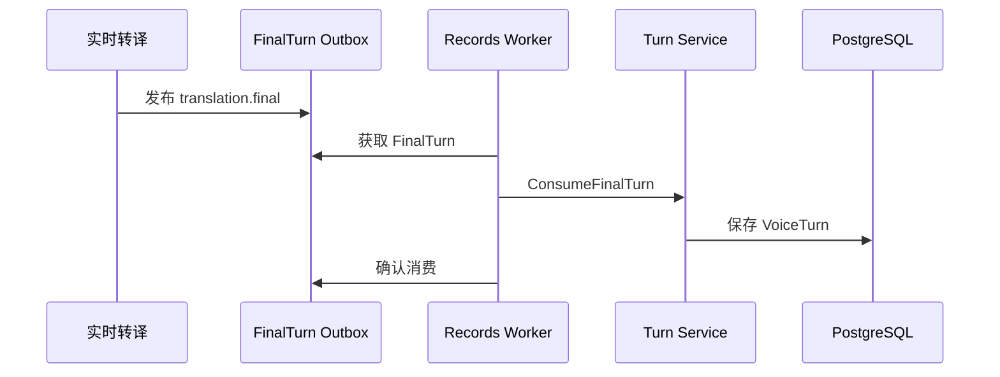

### 7.7 说话人归属状态机

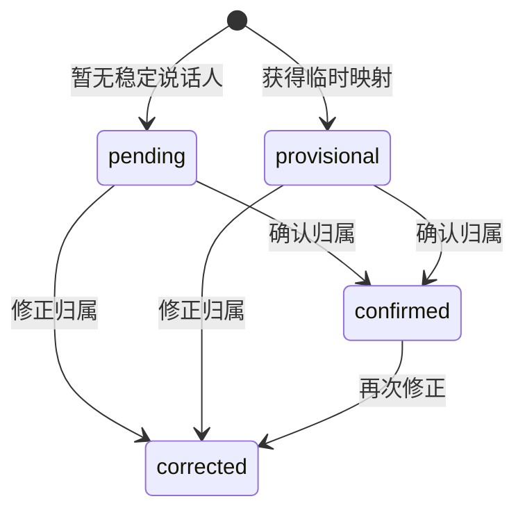

`participant_id` 可以为空，此时 `attribution_status` 为 `pending`，实时翻译不需要等待说话人最终确认。

### 7.8 异常处理

| 异常 | 处理规则 |
| --- | --- |
| FinalTurn 事件版本、Topic 或 Payload 非法 | Reject，不写入 VoiceTurn |
| 数据库临时故障 | Nack 并延迟重试，保留 Outbox Receipt |
| 相同 `event_id` 和相同 Payload 重放 | 幂等 Ack，不创建重复 VoiceTurn |
| 相同 `event_id` 对应不同 Payload | 判定幂等冲突并 Reject |
| 说话人暂时无法确定 | 允许 `participant_id=null` 和 `attribution_status=pending` |
| 普通账户尝试调用系统归属修正接口 | 返回 `403 forbidden`，不接受客户端伪造的 system actor |
| 查询其他账户的 Turn 或 Participant | 按不存在处理，不泄露记录 |

## 8. 账户、用量与消息投递模块

该模块包含三个相互关联的子域：账户认证、用量记录、消息投递。

### 8.1 账户子域

#### 职责

- 创建匿名账户；
- 使用手机号验证码完成注册或登录；
- 将匿名账户合并到注册账户；
- 签发和刷新 Access Token、Refresh Token；
- 注销登录会话；
- 为其他模块提供可信账户身份与账户继承关系。

#### 核心对象

| 对象 | 说明 |
| --- | --- |
| Account | 稳定业务身份，类型为 `anonymous` 或 `registered` |
| AccountSession | 可撤销登录会话，保存 Refresh Token 哈希和过期时间 |
| PhoneChallenge | 手机验证码挑战，保存摘要、有效期和尝试次数 |
| Tokens | Access Token、Refresh Token 和过期时间 |

#### HTTP 接口

| 方法 | 路径 | 请求 | 响应 |
| --- | --- | --- | --- |
| `POST` | `/api/v1/auth/anonymous` | 空 | `201 AuthResult` |
| `POST` | `/api/v1/auth/verification-codes` | `phone` | `202 challenge_id` |
| `POST` | `/api/v1/auth/phone/login` | `challenge_id`、`code`、`anonymous_account_id?` | `200 AuthResult` |
| `POST` | `/api/v1/auth/token/refresh` | `refresh_token` | `200 AuthResult` |
| `POST` | `/api/v1/auth/logout` | `refresh_token` | `204` |
| `GET` | `/api/v1/account/me` | Bearer Token | `200 Account` |

### 8.2 用量子域

#### 职责

- 接收 Realtime 各 Provider 阶段的 UsageFact；
- 按事件幂等身份记录不可变用量事实；
- 按 Session 或账户时间范围汇总 Token、音频时长和费用；
- 校验 UsageFact 的账户与 Session 归属一致。

#### UsageFact 事件

Topic：`usage.recorded`
版本：`event_version=1`

| 字段 | 含义 |
| --- | --- |
| `id` | 用量事实 ID |
| `idempotency_key` | `usage:{turn_id}:{service_type}` |
| `account_id` | 账户 ID |
| `session_id` | 会话 ID |
| `turn_id` | Turn ID |
| `service_type` | `asr`、`translation`、`tts`、`diarization` |
| `provider`、`model` | Provider 与模型 |
| `input_tokens`、`output_tokens` | Token 用量 |
| `audio_duration_ms` | 音频用量 |
| `cost_amount`、`currency` | 费用与币种 |
| `occurred_at` | 发生时间 |

#### HTTP 接口

| 方法 | 路径 | 请求 | 响应 |
| --- | --- | --- | --- |
| `GET` | `/api/v1/voice-sessions/{id}/usage` | Session ID | UsageSummary |
| `GET` | `/api/v1/usage/summary` | `period_start`、`period_end` | UsageSummary |

#### 用量记录时序

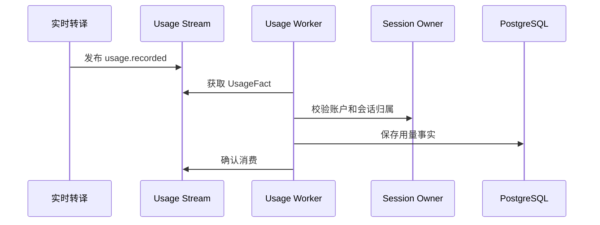

### 8.3 消息投递子域

#### 职责

- 管理账户的消息偏好和已验证投递目标；
- 从记录模块读取 final Turn；
- 创建不可变消息内容快照；
- 创建和跟踪 DeliveryAttempt；
- 通过 Email 或 WeChat Work Provider 异步投递；
- 提供消息状态查询和失败重试入口。

#### 核心对象

#### Message

| 字段 | 含义 |
| --- | --- |
| `id` | 消息 ID |
| `account_id` | 所属账户 |
| `channel` | `email` 或 `wechat` |
| `destination_ref` | 已验证目标引用 |
| `snapshot_version` | 消息快照版本 |
| `turns` | 不可变 FinalTurnSnapshot 数组 |
| `status` | `queued`、`sending`、`sent`、`failed`、`retrying`、`cancelled` |
| `attempts` | 尝试次数 |
| `last_error_code` | 最近投递错误 |

#### DeliveryAttempt

每次 Provider 调用对应一个独立 Attempt，状态为：

- `queued`；
- `sending`；
- `succeeded`；
- `failed`。

#### 消息 HTTP 接口

| 方法 | 路径 | 请求 | 响应 |
| --- | --- | --- | --- |
| `POST` | `/api/v1/outbound-messages` | `channel`、`destination_ref`、`turn_ids` | `202 Message` |
| `GET` | `/api/v1/outbound-messages/{message_id}` | Message ID | `200 Message` |
| `POST` | `/api/v1/outbound-deliveries/{message_id}/retry` | `Idempotency-Key` | `202 Message` |
| `GET` | `/api/v1/account/message-preferences` | Bearer Token | PreferenceList |
| `PUT` | `/api/v1/account/message-preferences/{channel}` | `enabled` | Preference |
| `GET` | `/api/v1/account/message-targets` | `channel?` | MessageTargetList |
| `POST` | `/api/v1/account/message-targets/email/verification-codes` | `email`、`destination_ref?` | `202` |
| `POST` | `/api/v1/account/message-targets/email/bind` | `token` | MessageTarget |
| `DELETE` | `/api/v1/account/message-targets/email/{destination_ref}` | 目标引用 | `204` |
| `POST` | `/api/v1/account/message-targets/wechat/bind` | OAuth `code` | MessageTarget |
| `DELETE` | `/api/v1/account/message-targets/wechat/{destination_ref}` | 目标引用 | `204` |

#### 消息投递时序

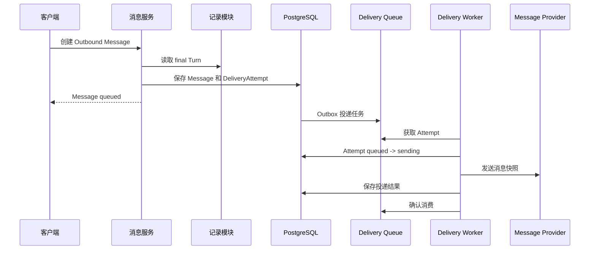

#### Message 状态机

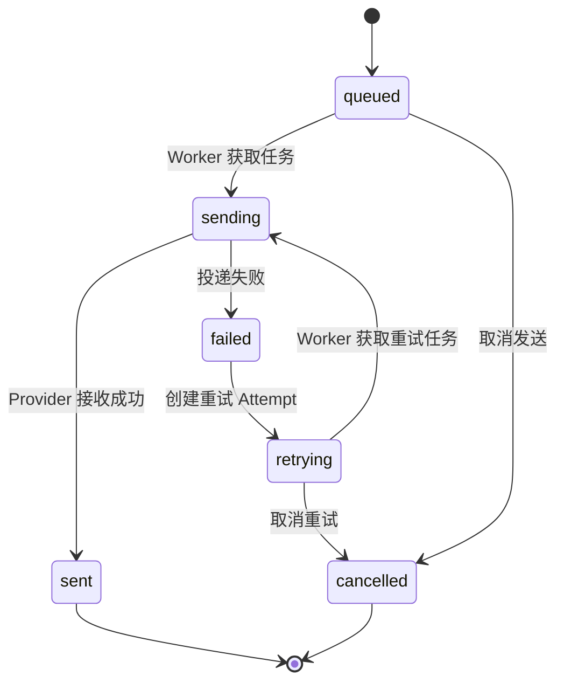

### 8.4 异常处理

| 子域 | 异常 | 处理规则 |
| --- | --- | --- |
| 账户 | 验证码错误、过期或尝试次数超限 | 返回稳定认证错误并执行限流，不签发 Token |
| 账户 | Refresh Token 已撤销或轮换 | 拒绝刷新，不恢复旧 Session |
| 用量 | Session 与 Account 归属不一致 | Reject UsageFact，不计入汇总 |
| 用量 | 相同幂等键重复消费 | 返回已有记录，不重复计费 |
| 消息 | 目标未验证、已撤销或偏好关闭 | 不创建可发送任务或将 Attempt 标记失败 |
| 消息 | Provider 确定性拒绝 | Attempt 失败，记录稳定错误码 |
| 消息 | Provider 结果不确定且不支持幂等 | 标记 `delivery_unknown`，禁止普通自动重放 |
| 消息 | Worker 或 Valkey 临时故障 | 保留 Outbox/Queue 状态，由 Worker 恢复消费 |
| 消息 | 手工重试重复提交 | 使用 `Idempotency-Key` 返回同一重试结果 |

## 9. 跨模块完整业务流程

### 9.1 会话创建到实时转译

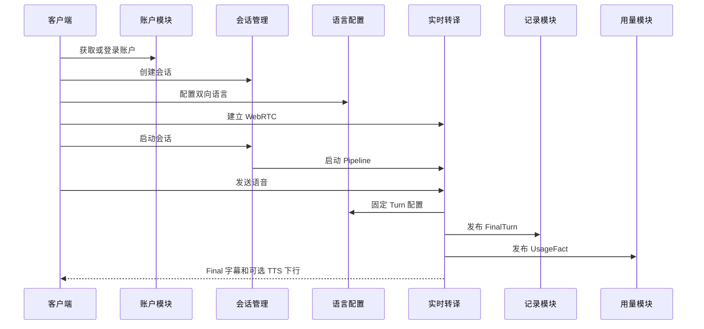

### 9.2 会话结束

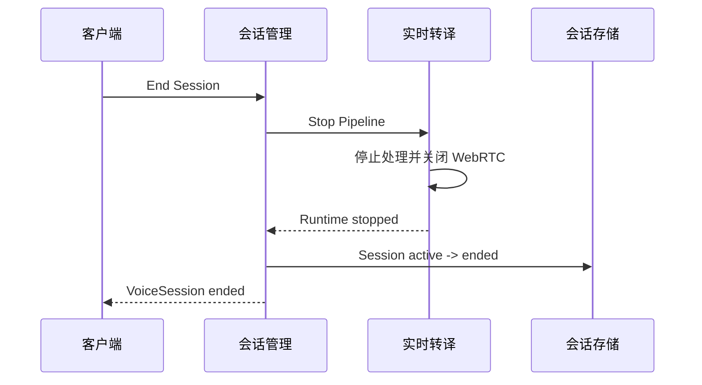

## 10. 数据归属与一致性边界

| 数据 | 事实来源 | 主要消费者 |
| --- | --- | --- |
| Account | 账户模块 | 所有业务模块 |
| VoiceSession 业务状态 | 会话管理模块 | 客户端、Realtime、记录和用量模块 |
| LanguageConfig | 语言配置模块 | 会话管理、Realtime |
| RuntimeState | 实时转译模块 | 会话管理、客户端 |
| ConnectionState | 实时转译模块 | 会话管理、客户端 |
| Participant / VoiceTurn | 记录模块 | 客户端、消息模块 |
| UsageFact / UsageSummary | 用量模块 | 客户端、运营统计 |
| Message / DeliveryAttempt | 消息模块 | 客户端、投递 Worker |

关键一致性约束：

- 一个数据对象只有一个权威写入模块；其他模块通过接口读取或通过事件提交事实。
- 配置版本、FinalTurn、UsageFact 和消息快照都保留生成时的版本与上下文，不回写为后续最新值。
- 业务会话结束前，Realtime 应完成 Pipeline 和连接关闭。
- FinalTurn 在翻译完成后产生，不依赖 TTS 和播放是否成功。
- 消息内容基于已持久化的 final Turn，不直接读取实时处理中间结果。

## 11. 设计依据

- Issue #83：说话人与转译记录；
- Issue #84：实时转译前端接口；
- Issue #85：实时转译后端接口；
- Issue #86：会话管理；
- Issue #87：账户、用量与消息投递；
- Issue #88：语言配置；
- `xe6-tsy/services/api`；
- `xe6-tsy/services/realtime-audio`；
- `xe6-tsy/apps/web`；
- `xe6-tsy/packages/contracts`；
- `upstream/dev@ce588c2`。

## 12. 当前实现差距

当前代码已经具备可运行 Web、API、Realtime、百炼 Provider、PostgreSQL/Valkey 装配、FinalTurn 持久化和 Email/企业微信投递基础。与本文档描述的完整模块能力相比，仍有以下差距：

1. 当前唯一实际参与切句的是 RMS 能量 VAD；百炼 `server_vad` 虽有协议适配，但当前 Pipeline 仍先由本地 Segmenter 切段，尚未形成由 Server VAD 独立拥有 Turn 边界的运行组合。
2. Qwen ASR 结果没有提供可用的 `provider_speaker_id`，单麦克风输入统一回退为 `local-mic`；Participant 存储已经存在，但没有实际人物语音分离或 diarization。
3. `REALTIME_TTS_DOWNLINK=opus` 只根据 PCM 长度发送固定的 Opus 静音帧 `f8 ff fe`，尚未接入 PCM 到 Opus 编码器，不能播放真实译音。
4. `pcm` 下行会在服务端缓存完整 Playback，前端收到全部分片后再拼接播放；它是真实可听链路，但不是边生成边播放的流式链路。
5. Realtime 已产生 Playback 打断与取消状态，Web 端目前只消费 `translation.final` 和 `tts.audio`，没有停止已排队 `AudioBufferSource` 的完整处理，抢话停止播音尚未端到端闭环。
6. ASR partial 保留在 Provider/Pipeline 内部，客户端只展示 `translation.final`；尚无稳定的增量字幕事件契约。
7. Web 当前只支持按钮开始和结束会话，本地 ASR 语音命令已经移除；“开始、单向传译、双向传译、结束会议”等命令尚无服务端意图与状态机实现。
8. TTS 端口支持请求级 `voice_id`，但当前所有 Session 共用启动环境中的 `TTS_VOICE`，切换音色需要修改配置并重启 Realtime；前端、Session 和数据库尚无会话级音色配置。
9. ICE Server 在运行入口中固定为 Google STUN。面对面单客户端场景不必预设 TURN 为固定组件，但国内网络可达性、服务器公网 Candidate 和目标网络直连成功率尚未形成生产验收；ICE Server 也未由部署环境动态配置。
10. WebRTC 连接进入 `disconnected` 或 `failed` 后，Web 端会显示失败并清理媒体，没有自动重新取票、重建 PeerConnection 和恢复会话的流程。
11. 消息投递已支持 Email 与企业微信应用消息，但消息内容仍由客户端选择已保存 Turn 后创建，不是订阅每个 FinalTurn 的实时字幕推送；飞书、钉钉、QQ 和个人微信没有 Provider 适配器。
12. PostgreSQL、FinalTurn Outbox、Valkey Usage/Delivery Worker 和生产 Provider 装配已经存在，但相关 Runtime 默认关闭，仍需在正式环境完成迁移、配置、进程恢复和数据不丢失验收。
13. API `/metrics` 目前主要提供投递和用量的少量进程内计数器，尚未覆盖 VAD、ASR、翻译、TTS、端到端延迟、WebRTC 连接质量和 Turn 级追踪。
14. Participant 更新与 Turn 归属修正要求可信 system actor，当前生产 HTTP 装配仍保持 fail-closed，未提供系统凭证入口。
15. 统一 OpenAPI 已包含业务会话、realtime ticket 和部分 Realtime 控制接口，但 WebRTC config、offer 和 ICE candidate 接口尚未全部进入同一契约文件。
