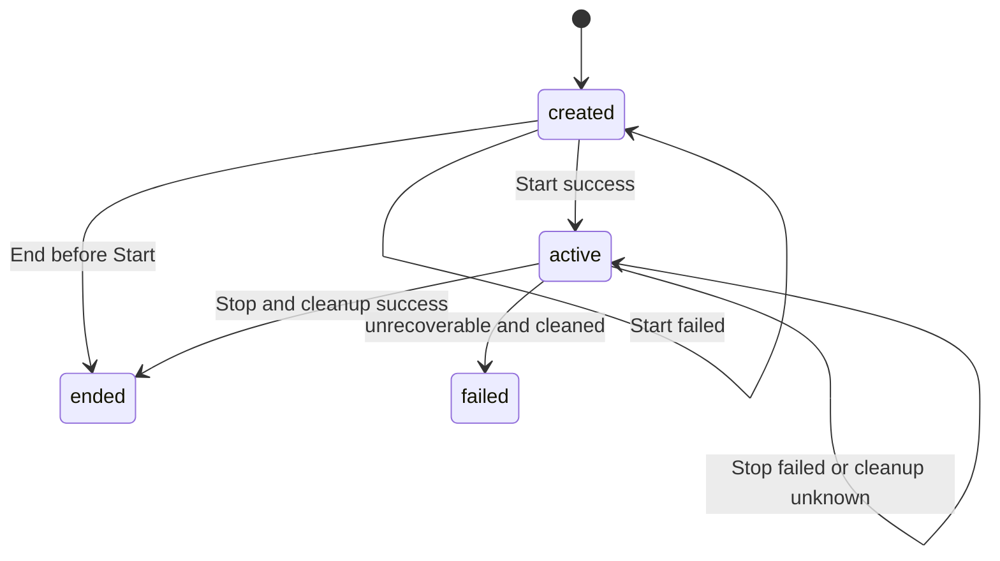

# Lingow P0 协议设计

---

## 1. 文档目标

本文档定义 Lingow P0 的跨模块协议，覆盖：

- REST 与 OpenAPI；
- 会话、Realtime、WebRTC 和语言配置状态；
- 请求、响应和错误结构；
- Realtime 控制与 WebRTC 信令；
- DataChannel 实时事件；
- 幂等、顺序、兼容性和安全约束。

本文档不包含数据库 DDL、模块内部实现、Provider 私有协议和代码完成度审核。

---

## 2. 协议总览

### 2.1 协议分层

| 场景 | 协议 | 入口 |
| --- | --- | --- |
| 账户、会话、语言、记录、用量、投递 | REST + JSON | `/api/v1` |
| Realtime 生命周期与 WebRTC 信令 | REST + JSON | `/realtime/v1` |
| 麦克风音频 | WebRTC Audio Track | PeerConnection |
| 字幕、TTS 音频和播放事件 | WebRTC DataChannel | `translation` |
| Final Turn | PostgreSQL Outbox | `translation.final` |
| Provider 用量 | Valkey/Redis Stream | `usage.recorded` |

### 2.2 身份

公共 API：

```http
Authorization: Bearer <access-token>
```

Realtime：

```http
Authorization: Bearer <realtime-ticket>
```

客户端不得通过 Header、Query 或 Body 指定可信 `account_id`。

### 2.3 OpenAPI 来源

| 合同 | 当前来源 |
| --- | --- |
| 账户、会话、用量、投递、Realtime Ticket | `packages/contracts/openapi.yaml` |
| Realtime 类型和 Ticket | `packages/contracts/realtime/v1` |
| Final Turn / Records 类型 | `packages/contracts/records/v1` |
| 语言配置 | `services/api/languages` 与 Issue #88 |

规则：

1. REST 字段变更先更新 OpenAPI。
2. 跨服务类型放入 `packages/contracts`。
3. 破坏性变更必须升级版本或提供迁移说明。
4. 语言配置迁入统一 OpenAPI 前，以本文件、Issue #88 和实现共同作为 P0 合同。

---

## 3. 状态定义

### 3.1 Session 状态

| 状态 | 说明 | 终态 |
| --- | --- | --- |
| `created` | Session 已创建，Pipeline 未启动 | 否 |
| `active` | Realtime Start 成功 | 否 |
| `ended` | 正常结束且资源已清理 | 是 |
| `failed` | 不可恢复故障结束且资源已清理 | 是 |



约束：

- Start 成功前不得写 `active`。
- Stop 和资源清理确认前不得写 `ended`。
- Stop 失败不等于 `failed`。
- `ended`、`failed` 不允许重新 Start。

### 3.2 Runtime 状态

```text
stopped
starting
listening
asr_processing
translating
tts_processing
playing
stopping
failed
```

Runtime 是 Realtime 服务的权威状态，不写入 `voice_sessions.status`。

### 3.3 WebRTC 连接状态

```text
new
connecting
connected
disconnected
failed
closed
```

只有 `connected` 可以满足 Session Start 的 WebRTC Readiness。

### 3.4 LanguageConfig 状态

```text
active
superseded
expired
```

- 同一 Session 同时最多一个 `active`。
- 新配置立即生效，旧配置进入 `superseded`。
- 当前 Turn 继续使用 Turn 开始时的配置快照。
- 下一 Turn 使用新配置。

### 3.5 其他状态

```text
Attribution：
pending -> provisional -> confirmed -> corrected

Playback：
idle -> playing -> finished
             └-> interrupted / cancelled
```

---

## 4. 通用 HTTP 约定

### 4.1 基础约定

| 项目 | 约定 |
| --- | --- |
| 传输 | HTTPS |
| 内容类型 | `application/json` |
| 时间 | RFC 3339，服务端统一 UTC |
| ID | 字符串，建议带资源前缀 ULID |
| 语言 | BCP-47，如 `zh-CN`、`en-US` |
| JSON | 拒绝未知字段和额外 JSON 文档 |
| 请求体上限 | 1 MiB |
| 分页 | `cursor`、`limit`、`next_cursor` |
| `limit` | 默认 20，最大 100 |

### 4.2 通用请求头

```http
Authorization: Bearer <token>
Idempotency-Key: <client-generated-key>
X-Request-ID: req_01J...
Content-Type: application/json
```

### 4.3 成功响应

- 单资源直接返回资源；
- 创建使用 `201 Created`；
- 查询和同步写入使用 `200 OK`；
- 异步受理使用 `202 Accepted`；
- 无响应体删除使用 `204 No Content`。

列表：

```json
{
  "items": [],
  "next_cursor": null
}
```

Session 列表当前使用：

```json
{
  "sessions": [],
  "next_cursor": null
}
```

### 4.4 错误响应

```json
{
  "error": {
    "code": "session_state_conflict",
    "message": "current session state does not allow this operation",
    "request_id": "req_01J...",
    "retryable": false,
    "details": {
      "current_status": "ended"
    }
  }
}
```

程序只依赖 `code` 和 HTTP Status，不依赖 `message`。

### 4.5 幂等

同一身份、接口和 `Idempotency-Key`：

| 情况 | 结果 |
| --- | --- |
| 请求语义相同 | 返回首次结果 |
| 请求语义不同 | `409 idempotency_key_conflict` |
| 首次请求仍执行 | 返回首次结果或明确并发冲突 |
| 下游结果不确定 | 通过持久化操作记录协调 |

`Idempotency-Key` 表示 HTTP 重放；`operation_id` 表示 Realtime Start 的运行实例所有权。

---

## 5. 核心数据结构

### 5.1 VoiceSession

```json
{
  "id": "vs_01J...",
  "account_id": "account_01J...",
  "status": "created",
  "audio_config": {
    "codec": "opus",
    "sample_rate_hz": 48000,
    "channels": 1,
    "echo_cancellation": true,
    "noise_suppression": true,
    "auto_gain_control": true
  },
  "capabilities": {
    "webrtc": true,
    "data_channel": true,
    "microphone": true,
    "speaker": true,
    "speaker_diarization": true
  },
  "started_at": null,
  "ended_at": null,
  "created_at": "2026-07-31T08:00:00Z"
}
```

P0 Readiness 固定要求：

```text
codec = opus
sample_rate_hz = 48000
channels = 1
所有 capabilities = true
```

### 5.2 LanguageConfig

```json
{
  "id": "langcfg_01J...",
  "session_id": "vs_01J...",
  "version": 3,
  "language_pairs": [
    {"source": "zh-CN", "target": "en-US"},
    {"source": "en-US", "target": "zh-CN"}
  ],
  "status": "active",
  "effective_from": "2026-07-31T08:01:00Z",
  "effective_until": null,
  "created_by": "account_01J...",
  "created_at": "2026-07-31T08:01:00Z"
}
```

注意：创建请求字段为 `languages`，响应字段为 `language_pairs`。

### 5.3 RuntimeSnapshot

```json
{
  "session_id": "vs_01J...",
  "start_operation_id": "op_01J...",
  "runtime_state": "listening",
  "current_turn_id": null,
  "current_playback_id": null,
  "last_error_code": null,
  "updated_at": "2026-07-31T08:02:00Z"
}
```

### 5.4 ConnectionSnapshot

```json
{
  "session_id": "vs_01J...",
  "connection_id": "rtc_01J...",
  "state": "connected",
  "version": 2,
  "updated_at": "2026-07-31T08:01:50Z"
}
```

### 5.5 VoiceSessionDetail

```json
{
  "id": "vs_01J...",
  "account_id": "account_01J...",
  "status": "active",
  "runtime_state": "listening",
  "current_turn_id": null,
  "current_playback_id": null,
  "last_error_code": null,
  "retryable": false,
  "runtime_updated_at": "2026-07-31T08:02:00Z",
  "started_at": "2026-07-31T08:02:00Z",
  "ended_at": null,
  "created_at": "2026-07-31T08:00:00Z"
}
```

Runtime 字段是聚合结果，不代表存储在 Session 表中。

### 5.6 RealtimeTicket

```json
{
  "ticket": "v1.<payload>.<signature>",
  "session_id": "vs_01J...",
  "expires_at": "2026-07-31T08:02:00Z"
}
```

Ticket Claims：

```json
{
  "session_id": "vs_01J...",
  "account_id": "account_01J...",
  "expires_at": "2026-07-31T08:02:00Z"
}
```

### 5.7 WebRTCConfig

```json
{
  "session_id": "vs_01J...",
  "expires_at": "2026-07-31T08:05:00Z",
  "ice_servers": [
    {"urls": ["stun:stun.l.google.com:19302"]}
  ],
  "ice_transport_policy": "all",
  "data_channel": {
    "label": "translation",
    "ordered": true
  },
  "audio": {
    "uplink_codec": "opus",
    "downlink_codec": "pcm",
    "sample_rate_hz": 24000,
    "channels": 1
  }
}
```

`downlink_codec`：

```text
none
pcm
opus
```

### 5.8 VoiceTurn

```json
{
  "id": "turn_01J...",
  "session_id": "vs_01J...",
  "participant_id": null,
  "speaker_code": "speaker_pending",
  "sequence_no": 8,
  "source_language": "zh-CN",
  "target_language": "en-US",
  "language_config_version": 3,
  "source_text": "你好",
  "translated_text": "Hello",
  "speaker_confidence": null,
  "attribution_status": "pending",
  "started_at": "2026-07-31T08:03:00Z",
  "ended_at": "2026-07-31T08:03:02Z",
  "created_at": "2026-07-31T08:03:03Z"
}
```

只保存 Final Turn；文本、语言方向、配置版本和序号写入后不可修改。

---

## 6. REST 接口

### 6.1 接口清单

#### 账户与认证

| 方法 | 路径 |
| --- | --- |
| `POST` | `/api/v1/auth/anonymous` |
| `POST` | `/api/v1/auth/verification-codes` |
| `POST` | `/api/v1/auth/phone/login` |
| `POST` | `/api/v1/auth/token/refresh` |
| `POST` | `/api/v1/auth/logout` |
| `GET` | `/api/v1/account/me` |

#### Session

| 方法 | 路径 | 用途 |
| --- | --- | --- |
| `POST` | `/api/v1/voice-sessions` | 创建 |
| `GET` | `/api/v1/voice-sessions` | 列表 |
| `GET` | `/api/v1/voice-sessions/{id}` | 详情 |
| `POST` | `/api/v1/voice-sessions/{id}/start` | 启动 |
| `POST` | `/api/v1/voice-sessions/{id}/end` | 结束 |
| `GET` | `/api/v1/voice-sessions/{id}/state` | 状态 |
| `POST` | `/api/v1/voice-sessions/{id}/realtime-ticket` | 签发 Ticket |

#### LanguageConfig

| 方法 | 路径 |
| --- | --- |
| `GET` | `/api/v1/languages` |
| `GET` | `/api/v1/voice-sessions/{id}/language-config` |
| `POST` | `/api/v1/voice-sessions/{id}/language-configs` |
| `GET` | `/api/v1/voice-sessions/{id}/language-configs` |

#### Records

| 方法 | 路径 |
| --- | --- |
| `GET` | `/api/v1/voice-sessions/{id}/participants` |
| `PATCH` | `/api/v1/voice-sessions/{id}/participants/{participant_id}` |
| `GET` | `/api/v1/voice-sessions/{id}/turns` |
| `GET` | `/api/v1/voice-turns/{id}` |
| `PATCH` | `/api/v1/voice-turns/{id}/attribution` |
| `GET` | `/api/v1/translation-history` |

两个 PATCH 为 system-only。

#### Usage 与 Delivery

| 方法 | 路径 |
| --- | --- |
| `GET` | `/api/v1/voice-sessions/{id}/usage` |
| `GET` | `/api/v1/usage/summary` |
| `POST` | `/api/v1/outbound-messages` |
| `GET` | `/api/v1/outbound-messages/{message_id}` |
| `POST` | `/api/v1/outbound-deliveries/{message_id}/retry` |
| `GET` | `/api/v1/account/message-preferences` |
| `PUT` | `/api/v1/account/message-preferences/{channel}` |
| `GET` | `/api/v1/account/message-targets` |
| `POST` | `/api/v1/account/message-targets/email/verification-codes` |
| `POST` | `/api/v1/account/message-targets/email/bind` |
| `DELETE` | `/api/v1/account/message-targets/email/{destination_ref}` |
| `POST` | `/api/v1/account/message-targets/wechat/bind` |
| `DELETE` | `/api/v1/account/message-targets/wechat/{destination_ref}` |

### 6.2 创建 Session

```http
POST /api/v1/voice-sessions
Authorization: Bearer <access-token>
Idempotency-Key: create-session-001
Content-Type: application/json
```

请求：

```json
{
  "audio_config": {
    "codec": "opus",
    "sample_rate_hz": 48000,
    "channels": 1,
    "echo_cancellation": true,
    "noise_suppression": true,
    "auto_gain_control": true
  },
  "capabilities": {
    "webrtc": true,
    "data_channel": true,
    "microphone": true,
    "speaker": true,
    "speaker_diarization": true
  }
}
```

响应：`201 Created`，返回 `VoiceSession`。

错误：

| HTTP | 错误码 |
| --- | --- |
| `400` | `invalid_request` |
| `401` | `unauthorized` |
| `409` | `idempotency_key_conflict` |
| `422` | `unsupported_audio_config` |
| `501` | `not_implemented` |

### 6.3 Session 列表与详情

```http
GET /api/v1/voice-sessions?status=active&limit=20&cursor=<cursor>
GET /api/v1/voice-sessions/{id}
```

列表不查询 Runtime；详情返回 `VoiceSessionDetail`。

详情错误：

| HTTP | 错误码 |
| --- | --- |
| `404` | `voice_session_not_found` |
| `501` | `not_implemented` |
| `503` | `runtime_state_unavailable` |

### 6.4 启动 Session

```http
POST /api/v1/voice-sessions/{id}/start
Authorization: Bearer <access-token>
Idempotency-Key: start-session-001
```

请求体必须为空。

处理顺序：

```text
1. 校验账户与 Session
2. 校验 status=created
3. 创建或读取 StartOperation
4. 校验 active LanguageConfig
5. 校验 Connection.state=connected
6. 调用 Realtime Start
7. 校验 operation_id 和 RuntimeSnapshot
8. 更新 Session 为 active
```

响应：`200 OK`，返回 `active` VoiceSession。

错误：

| HTTP | 错误码 |
| --- | --- |
| `400` | `invalid_request` |
| `404` | `voice_session_not_found` |
| `409` | `session_state_conflict` |
| `409` | `language_config_not_ready` |
| `409` | `webrtc_not_ready` |
| `409` | `session_start_in_progress` |
| `409` | `idempotency_key_conflict` |
| `501` | `not_implemented` |
| `503` | `realtime_start_failed` |
| `503` | `runtime_state_unavailable` |

### 6.5 结束 Session

```http
POST /api/v1/voice-sessions/{id}/end
Authorization: Bearer <access-token>
Idempotency-Key: end-session-001
Content-Type: application/json
```

请求：

```json
{
  "reason": "user_requested"
}
```

允许：

```text
user_requested
operator_cancelled
client_disconnected
```

请求体省略时默认为 `user_requested`。

处理规则：

```text
created -> 直接 ended

active ->
    持久化 EndIntent
    调用 Realtime Stop
    确认 Runtime stopped 和资源清理
    更新为 ended
```

Stop 失败时保持 `active`，不写 `ended_at`，由恢复 Worker 重试。

### 6.6 Session 状态

```http
GET /api/v1/voice-sessions/{id}/state
```

响应：

```json
{
  "id": "vs_01J...",
  "status": "active",
  "runtime_state": "listening",
  "current_turn_id": null,
  "current_playback_id": null,
  "last_error_code": null,
  "retryable": false,
  "runtime_updated_at": "2026-07-31T08:02:00Z"
}
```

### 6.7 签发 Realtime Ticket

```http
POST /api/v1/voice-sessions/{id}/realtime-ticket
Authorization: Bearer <access-token>
```

请求体必须为空。

响应：`200 OK`

```json
{
  "ticket": "v1.<payload>.<signature>",
  "session_id": "vs_01J...",
  "expires_at": "2026-07-31T08:02:00Z"
}
```

无权访问时按资源隐藏策略返回 `404 voice_session_not_found`。

### 6.8 创建 LanguageConfig

```http
POST /api/v1/voice-sessions/{id}/language-configs
Authorization: Bearer <access-token>
Idempotency-Key: language-config-003
Content-Type: application/json
```

请求：

```json
{
  "languages": [
    {"source": "zh-CN", "target": "en-US"},
    {"source": "en-US", "target": "zh-CN"}
  ],
  "expected_version": 2
}
```

响应：`201 Created`，返回新 `LanguageConfig`。

错误：

| HTTP | 错误码 |
| --- | --- |
| `400` | `invalid_language_pair` |
| `400` | `unsupported_language` |
| `404` | `voice_session_not_found` |
| `409` | `version_conflict` |
| `409` | `idempotency_conflict` |

### 6.9 LanguageConfig 查询

```http
GET /api/v1/languages
GET /api/v1/voice-sessions/{id}/language-config
GET /api/v1/voice-sessions/{id}/language-configs?limit=20&cursor=<cursor>
```

无当前配置：

```text
404 no_active_config
```

---

## 7. Realtime 与 WebRTC 接口

所有接口使用 Realtime Ticket。

### 7.1 接口清单

| 方法 | 路径 |
| --- | --- |
| `GET` | `/realtime/v1/sessions/{session_id}/webrtc/config` |
| `POST` | `/realtime/v1/sessions/{session_id}/webrtc/offer` |
| `POST` | `/realtime/v1/sessions/{session_id}/ice-candidates` |
| `GET` | `/realtime/v1/sessions/{session_id}/connection` |
| `POST` | `/realtime/v1/sessions/{session_id}/start` |
| `POST` | `/realtime/v1/sessions/{session_id}/stop` |
| `GET` | `/realtime/v1/sessions/{session_id}/runtime` |

### 7.2 WebRTC Config

```http
GET /realtime/v1/sessions/{session_id}/webrtc/config
Authorization: Bearer <realtime-ticket>
```

响应：`WebRTCConfig`。

### 7.3 Offer / Answer

```http
POST /realtime/v1/sessions/{session_id}/webrtc/offer
Authorization: Bearer <realtime-ticket>
Idempotency-Key: offer-001
```

请求：

```json
{
  "sdp": "v=0\r\n...",
  "type": "offer"
}
```

响应：

```json
{
  "session_id": "vs_01J...",
  "connection_id": "rtc_01J...",
  "sdp": "v=0\r\n...",
  "type": "answer"
}
```

约束：

- `type` 固定为 `offer`；
- SDP 必须支持 Opus 上行；
- 相同 Key 和 Offer 返回首次 Answer；
- 旧连接回调不得覆盖新的 Connection Generation。

### 7.4 ICE Candidate

```http
POST /realtime/v1/sessions/{session_id}/ice-candidates
```

请求：

```json
{
  "candidates": [
    {
      "candidate": "candidate:...",
      "sdp_mid": "0",
      "sdp_mline_index": 0
    }
  ]
}
```

响应：

```json
{
  "accepted": 1
}
```

### 7.5 Connection

```http
GET /realtime/v1/sessions/{session_id}/connection
```

响应：`ConnectionSnapshot`。

无当前连接：

```text
404 webrtc_connection_not_found
```

### 7.6 Realtime Start

```http
POST /realtime/v1/sessions/{session_id}/start
Authorization: Bearer <realtime-ticket>
Idempotency-Key: <start-operation-id>
```

请求：

```json
{
  "operation_id": "op_01J...",
  "trace_id": "req_01J...",
  "started_by": "account_01J..."
}
```

响应：`RuntimeSnapshot`。

约束：

- `operation_id` 必填；
- Connection 必须为 `connected`；
- 返回的 `start_operation_id` 必须与请求一致；
- 相同 `operation_id` 幂等；
- 不同 `operation_id` 不得接管正在运行的 Pipeline。

### 7.7 Realtime Stop

```http
POST /realtime/v1/sessions/{session_id}/stop
Authorization: Bearer <realtime-ticket>
Idempotency-Key: stop-user_requested
```

请求：

```json
{
  "trace_id": "req_01J...",
  "reason": "user_requested",
  "ended_at": "2026-07-31T08:30:00Z"
}
```

成功返回 `runtime_state=stopped` 的 `RuntimeSnapshot`。

Stop 成功前必须完成 Pipeline、Provider Context、DataChannel、Track 和 PeerConnection 清理。

### 7.8 Runtime

```http
GET /realtime/v1/sessions/{session_id}/runtime
```

响应：`RuntimeSnapshot`。

---

## 8. DataChannel 事件

### 8.1 配置

```json
{
  "label": "translation",
  "ordered": true
}
```

事件类型同时写入：

```json
{
  "type": "translation.final",
  "event": "translation.final"
}
```

客户端优先读取 `event`，兼容读取 `type`。

### 8.2 `translation.final`

```json
{
  "type": "translation.final",
  "event": "translation.final",
  "turn_id": "turn_01J...",
  "id": "evt_01J...",
  "session_id": "vs_01J...",
  "source_text": "你好",
  "translated_text": "Hello",
  "source_language": "zh-CN",
  "target_language": "en-US",
  "sequence": 8,
  "language_config_version": 3
}
```

只发送 Final 结果。DataChannel 失败不得回滚 Durable Final Turn。

### 8.3 `tts.audio`

```json
{
  "type": "tts.audio",
  "event": "tts.audio",
  "playback_id": "playback_01J...",
  "session_id": "vs_01J...",
  "turn_id": "turn_01J...",
  "sample_rate_hz": 24000,
  "channels": 1,
  "encoding": "pcm_s16le",
  "pcm_base64": "<base64>",
  "sequence": 1,
  "final": false
}
```

规则：

- 单条音频数据不超过 8 KiB；
- 按 `playback_id + sequence` 重组；
- `final=true` 表示最后一个分片；
- `encoding` 为 `pcm_s16le` 或 `audio_container`；
- Playback 中断后丢弃未播放分片。

### 8.4 Playback 事件

公共字段：

```json
{
  "type": "playback.started",
  "event": "playback.started",
  "event_id": "evt_01J...",
  "session_id": "vs_01J...",
  "turn_id": "turn_01J...",
  "playback_id": "playback_01J...",
  "sequence": 1,
  "occurred_at": "2026-07-31T08:03:04Z"
}
```

事件：

```text
playback.started
playback.finished
playback.interrupted
playback.cancelled
```

`playback.interrupted` 增加：

```json
{
  "reason": "barge_in"
}
```

建议 Reason：

```text
barge_in
session_stopped
provider_failed
client_cancelled
```

### 8.5 顺序与恢复

- 同一 Playback 的 `sequence` 单调递增；
- 重复事件或分片幂等忽略；
- 出现缺口时查询 `/state`、`/runtime` 或 `/connection`；
- P0 不保证 DataChannel 断线重放；
- 历史 Final Turn 通过 Records REST 补拉。

---

## 9. 可靠事件

### 9.1 FinalTurnEvent

主题：

```text
translation.final
```

关键字段：

```text
event_version
event_id
trace_id
turn_id
session_id
participant_id?
sequence_no
source_language
target_language
language_config_version
source_text
translated_text
speaker_code
speaker_confidence?
attribution_status
started_at
ended_at
occurred_at
```

规则：

- Durable Outbox 接受后才算发布成功；
- Consumer 写入后 ACK；
- 临时错误 NACK；
- Schema 错误或 Payload 冲突 Reject；
- 相同事件重放时 Payload 不得变化。

### 9.2 UsageFact

主题：

```text
usage.recorded
```

阶段：

```text
asr
translation
tts
diarization
```

规则：

- 每个阶段独立产生；
- 按 `idempotency_key` 幂等；
- 金额使用十进制定点字符串；
- Usage 失败不重跑已完成的 ASR 和翻译。

---

## 10. 错误码

### 10.1 HTTP 映射

| HTTP | 语义 |
| ---: | --- |
| `400` | 请求或字段非法 |
| `401` | 未认证 |
| `403` | 无权限 |
| `404` | 资源不存在或隐藏 |
| `409` | 状态、版本、并发或幂等冲突 |
| `422` | 能力不支持 |
| `429` | 限流 |
| `500` | 未预期错误 |
| `501` | 当前部署未实现 |
| `503` | 临时不可用 |

### 10.2 稳定错误码

| 范围 | 错误码 |
| --- | --- |
| 通用 | `invalid_request` `unauthorized` `forbidden` `rate_limited` `not_implemented` `internal_error` `temporarily_unavailable` |
| Session | `voice_session_not_found` `session_state_conflict` `session_start_in_progress` `idempotency_key_conflict` `unsupported_audio_config` |
| Readiness | `language_config_not_ready` `webrtc_not_ready` |
| Realtime | `realtime_start_failed` `realtime_stop_failed` `runtime_state_unavailable` `runtime_operation_conflict` |
| Language | `no_active_config` `version_conflict` `idempotency_conflict` `unsupported_language` `invalid_language_pair` |
| WebRTC | `realtime_ticket_required` `realtime_ticket_invalid` `webrtc_connection_not_found` `webrtc_connection_not_ready` `webrtc_connection_conflict` `invalid_webrtc_offer` `webrtc_unavailable` |
| Records | `participant_not_found` `voice_turn_not_found` `invalid_attribution` `event_payload_conflict` |

---

## 11. 校验与失败处理

### 11.1 Language Pair

P0 必须正好提交两个互为相反方向的 Pair：

```json
[
  {"source": "zh-CN", "target": "en-US"},
  {"source": "en-US", "target": "zh-CN"}
]
```

`source` 不得等于 `target`，且两种语言都必须启用。

### 11.2 Start Readiness

```text
Session.status == created
LanguageConfig.status == active
LanguageConfig 为有效双向 Pair
Connection.state == connected
AudioConfig 和 Capabilities 合法
不存在冲突的 StartOperation
```

### 11.3 End

- `created` 可以直接 End；
- `active` 必须先 Stop；
- Stop 失败保持 `active`；
- EndIntent 必须持久化并可恢复；
- 资源清理确认后才能写 `ended`。

### 11.4 Owner 与 Actor

- `voice_sessions.account_id` 是不可变 Owner；
- 注册账户可通过 Account Lineage 访问原匿名 Session；
- `started_by` 表示本次 Actor；
- Operation Ownership 必须与不可变 Owner 对齐；
- Owner 和 Actor 不得混用。

---

## 12. 兼容性与安全

### 12.1 兼容性

- 新增可选响应字段属于兼容修改；
- 删除、改名、改类型和收紧枚举属于破坏性修改；
- 客户端忽略未知响应字段；
- 服务端拒绝未知请求字段；
- DataChannel 未知事件应安全忽略；
- 破坏性事件修改升级 `event_version` 或 `schema_version`。

### 12.2 OpenAPI

- REST 修改先更新 OpenAPI；
- OpenAPI 覆盖路径、鉴权、请求、响应和错误状态；
- 语言配置和 Records 最终应进入统一生成链路；
- 手写类型和生成类型不能长期同时作为权威来源。

### 12.3 安全

- Access Token 只由可信中间件解析；
- Realtime Ticket 使用独立 HMAC Secret，至少 32 字节；
- Ticket 只绑定一个 Session，默认短期有效；
- Token、Ticket、Secret、验证码和 Provider Key 不得写日志；
- System-only Records PATCH 不接受普通 Access Token；
- 无可信 System Actor 时必须 fail-closed。

---

## 13. P0 限制

当前不作为稳定合同：

- 三种及以上语言；
- 重叠发言；
- 跨 Session 长期声纹身份；
- DataChannel 全量断线重放；
- Runtime 跨实例迁移；
- 自动历史说话人修正；
- 普通用户调用 system-only PATCH。

TTS 下行：

| 模式 | 协议 | 说明 |
| --- | --- | --- |
| `none` | 仅字幕 | 默认可用 |
| `pcm` | DataChannel `tts.audio` | P0 浏览器演示推荐 |
| `opus` | WebRTC Audio Track | 完整编码链路完成后使用 |

---

## 14. 参考依据

- `packages/contracts/openapi.yaml`
- `packages/contracts/realtime/v1`
- `packages/contracts/records/v1`
- `services/api/sessions`
- `services/api/languages`
- `services/api/realtimeaccess`
- `services/realtime-audio/controlplane`
- `services/realtime-audio/webrtc`
- `services/realtime-audio/localruntime`
- Issue #80、#84、#85、#86、#88
- ClawPet Issue #73
